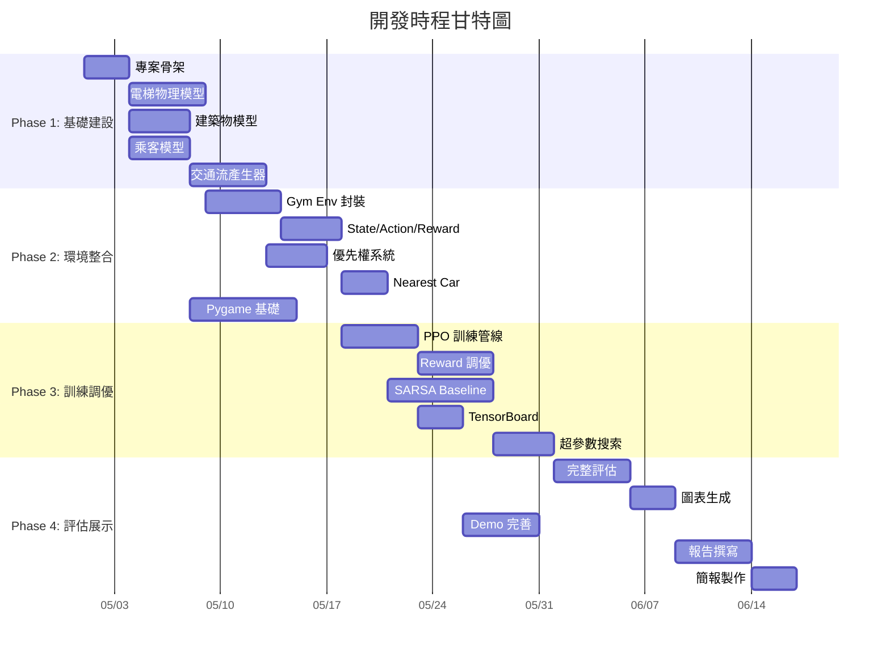

# OpenSpec v1.0 — 基於 DRL 之智慧醫院電梯群控與優先調度系統

> **Smart Hospital Elevator Group Control & Priority Dispatching System (EGCS)**
> based on Deep Reinforcement Learning

| 項目     | 內容                                         |
| -------- | -------------------------------------------- |
| 版本     | v1.0                                        |
| 日期     | 2026-04-27                                  |
| 課程     | 深度強化學習 期末專題                          |
| 團隊規模 | 4 人                                         |
| 開發週期 | 約 8 週                                      |

---

## 目錄

1. [Executive Summary](#1-executive-summary)
2. [System Architecture](#2-system-architecture)
3. [MDP 完整定義](#3-mdp-完整定義)
4. [演算法設計](#4-演算法設計)
5. [優先調度機制](#5-優先調度機制)
6. [模擬引擎規格](#6-模擬引擎規格)
7. [資料管線與實驗追蹤](#7-資料管線與實驗追蹤)
8. [評估框架](#8-評估框架)
9. [視覺化與展示](#9-視覺化與展示)
10. [測試策略](#10-測試策略)
11. [開發里程碑](#11-開發里程碑)
12. [風險分析與緩解](#12-風險分析與緩解)
13. [模組間介面契約](#13-模組間介面契約)
14. [附錄](#14-附錄)

---

## 1. Executive Summary

### 1.1 問題陳述

在大型醫院的垂直交通管理中，每一秒的延誤都可能影響醫療救護品質。傳統電梯系統採用固定規則調度（如最近者優先 Nearest Car），無法區分「一般探病家屬」與「運送中的急診病床」，導致高優先級醫療任務在尖峰時段被迫與一般乘客競爭電梯資源。

### 1.2 解決方案

本專案導入 **深度強化學習（Deep Reinforcement Learning, DRL）** 作為電梯群控系統的「中央智慧大腦」，賦予系統以下能力：

- **主動預測**：根據當前電梯狀態、乘客分佈與歷史交通流模式，預判最優派梯策略
- **優先權感知**：透過無感感測技術（NFC/BLE 模擬），自動識別急診病床、醫護人員、輪椅族群等特殊身份，動態調整調度權重
- **群控協作**：AI 不再只看單台電梯是否靠近來客，而是監控整棟電梯的「負載平衡」，當緊急任務發生時能即時重新分配指派

### 1.3 預期成果

| KPI                    | 目標                        |
| ---------------------- | --------------------------- |
| 急診任務平均等待時間   | 相較傳統規則降低 **≥ 30%** |
| 全體乘客平均等待時間   | 相較傳統規則降低 **≥ 15%** |
| 電梯空跑率（無效移動） | 降低 **≥ 20%**             |
| 訓練收斂               | ≤ 500K timesteps 內穩定    |

### 1.4 參考文獻

- **專案提案書**：〈基於 DRL 之智慧醫院電梯群控與優先調度系統〉
- **參考論文**：曾凡琳等，〈基于 Agent 的强化学习电梯群控自适应多目标优化方法设计〉，天津大學，IEEE CDC/CCC 2009
  - 該論文以 SARSA(λ) + Tile Coding 進行評價函數參數的自適應優化，本專案將其作為 baseline 對照組

---

## 2. System Architecture

### 2.1 四層架構設計

```
┌──────────────────────────────────────────────────────────────┐
│                    Presentation Layer                        │
│  ┌──────────────┐  ┌──────────────┐  ┌───────────────────┐  │
│  │  Pygame 即時  │  │  Matplotlib  │  │  Streamlit/Web    │  │
│  │  視覺化引擎  │  │  訓練曲線    │  │  Dashboard (可選) │  │
│  └──────────────┘  └──────────────┘  └───────────────────┘  │
├──────────────────────────────────────────────────────────────┤
│                   Orchestration Layer                        │
│  ┌──────────────┐  ┌──────────────┐  ┌───────────────────┐  │
│  │  Experiment  │  │  Hyperparameter│ │  Model            │  │
│  │  Manager     │  │  Scheduler    │  │  Checkpoint Mgr   │  │
│  └──────────────┘  └──────────────┘  └───────────────────┘  │
├──────────────────────────────────────────────────────────────┤
│                   Intelligence Layer                         │
│  ┌──────────────┐  ┌──────────────┐  ┌───────────────────┐  │
│  │  PPO Agent   │  │  SARSA(λ)    │  │  Nearest Car      │  │
│  │  (Primary)   │  │  (Baseline)  │  │  (Baseline)       │  │
│  └──────────────┘  └──────────────┘  └───────────────────┘  │
├──────────────────────────────────────────────────────────────┤
│                    Simulation Layer                          │
│  ┌──────────────┐  ┌──────────────┐  ┌───────────────────┐  │
│  │  Elevator    │  │  Traffic     │  │  Priority Event   │  │
│  │  Physics Eng.│  │  Generator   │  │  System           │  │
│  └──────────────┘  └──────────────┘  └───────────────────┘  │
│  ┌──────────────────────────────────────────────────────────┐│
│  │             Gymnasium Env Wrapper (gym.Env)              ││
│  └──────────────────────────────────────────────────────────┘│
└──────────────────────────────────────────────────────────────┘
```

### 2.2 技術棧詳細規格

| 層級          | 技術選擇                          | 版本需求   | 用途說明                                 |
| ------------- | --------------------------------- | ---------- | ---------------------------------------- |
| 語言          | Python                           | ≥ 3.10    | 專案主要開發語言                         |
| RL 環境       | Gymnasium (原 OpenAI Gym)         | ≥ 0.29    | 標準化 RL 環境介面                       |
| RL 訓練框架   | Stable-Baselines3 (SB3)          | ≥ 2.0     | PPO 實作、訓練與推論                     |
| 視覺化        | Pygame                           | ≥ 2.5     | 即時渲染電梯運行動畫                     |
| 繪圖          | Matplotlib / Seaborn              | Latest     | 訓練曲線、效能比較圖                     |
| 日誌/追蹤     | TensorBoard / Weights & Biases   | Latest     | 訓練指標即時監控                         |
| 數值計算      | NumPy                            | ≥ 1.24    | 狀態向量運算                             |
| 設定管理      | YAML / Hydra (可選)              | —          | 超參數與環境設定檔                       |
| 測試          | pytest                           | ≥ 7.0     | 單元測試與整合測試                       |

### 2.3 目錄結構設計

```
elevator-egcs/
├── configs/                    # 設定檔目錄
│   ├── env_default.yaml        # 環境預設參數
│   ├── train_ppo.yaml          # PPO 訓練超參數
│   └── scenarios/              # 不同交通流場景
│       ├── morning_peak.yaml
│       ├── evening_peak.yaml
│       └── mixed_traffic.yaml
├── src/
│   ├── __init__.py
│   ├── envs/                   # Simulation Layer
│   │   ├── __init__.py
│   │   ├── elevator_env.py     # Gymnasium 環境主類別
│   │   ├── building.py         # 建築物模型
│   │   ├── elevator.py         # 單台電梯物理模型
│   │   ├── passenger.py        # 乘客模型（含優先級）
│   │   ├── traffic_generator.py# 交通流產生器
│   │   └── priority_system.py  # 優先權事件系統
│   ├── agents/                 # Intelligence Layer
│   │   ├── __init__.py
│   │   ├── ppo_agent.py        # PPO 代理人封裝
│   │   ├── sarsa_agent.py      # SARSA(λ) baseline
│   │   └── rule_based.py       # 規則式 baseline (Nearest Car)
│   ├── rewards/                # 獎勵函數模組
│   │   ├── __init__.py
│   │   └── reward_functions.py # 多目標獎勵函數
│   ├── utils/                  # 工具模組
│   │   ├── __init__.py
│   │   ├── metrics.py          # KPI 計算
│   │   ├── logger.py           # 日誌工具
│   │   └── config_loader.py    # 設定檔載入
│   └── visualization/          # Presentation Layer
│       ├── __init__.py
│       ├── pygame_renderer.py  # Pygame 即時渲染
│       ├── charts.py           # 靜態圖表生成
│       └── dashboard.py        # Web Dashboard (可選)
├── scripts/
│   ├── train.py                # 訓練入口腳本
│   ├── evaluate.py             # 評估腳本
│   ├── demo.py                 # Demo 展示腳本
│   └── compare_baselines.py    # Baseline 比較腳本
├── tests/
│   ├── test_elevator.py
│   ├── test_env.py
│   ├── test_traffic.py
│   ├── test_priority.py
│   └── test_reward.py
├── notebooks/                  # 分析用 Jupyter Notebooks
│   └── analysis.ipynb
├── models/                     # 訓練模型存放
│   └── .gitkeep
├── logs/                       # TensorBoard 日誌
│   └── .gitkeep
├── requirements.txt
├── pyproject.toml
├── README.md
└── OpenSpec.md                 # 本文件
```

---

## 3. MDP 完整定義

### 3.1 環境配置參數

以下為可透過 `configs/env_default.yaml` 調整的環境物理參數：

```yaml
building:
  num_floors: 16           # 樓層數（參考論文：16 層）
  floor_height_lobby: 4.0  # 大廳樓層高度 (m)
  floor_height_normal: 3.0 # 一般樓層高度 (m)

elevator:
  num_elevators: 4         # 電梯數量（參考論文：4 台）
  max_capacity: 12         # 額定容量 (人)
  rated_speed: 2.5         # 額定速度 (m/s)
  acceleration: 1.0        # 加速度 (m/s²)
  door_open_time: 1.0      # 開門時間 (s)
  door_close_time: 1.0     # 關門時間 (s)
  boarding_time_per_person: 1.5  # 每人進出時間 (s)

priority:
  door_extension_wheelchair: 3.0  # 輪椅族延長開門 (s)
  emergency_timeout_penalty: 10.0 # 急診超時懲罰基數
```

### 3.2 State Space $\mathcal{S}$ — 狀態空間詳細定義

狀態向量以**扁平化 (flattened)** 一維浮點向量表達，供神經網路直接輸入。設 $N_e$ 為電梯數、$N_f$ 為樓層數。

#### 3.2.1 電梯狀態子向量 (per elevator, 重複 $N_e$ 次)

| 特徵                   | 維度 | 編碼方式                     | 值域         | 說明                           |
| ---------------------- | ---- | ---------------------------- | ------------ | ------------------------------ |
| `position`             | 1    | 正規化到 $[0, 1]$           | $[0, 1]$    | 當前樓層 / 最高樓層            |
| `direction`            | 1    | $\{-1, 0, +1\}$             | $[-1, 1]$   | 下行 / 靜止 / 上行             |
| `load_ratio`           | 1    | 當前載客 / 額定容量           | $[0, 1]$    | 擁擠度                         |
| `door_state`           | 1    | $\{0, 1\}$                  | $\{0, 1\}$ | 門關閉 = 0 / 門開啟 = 1        |
| `internal_calls`       | $N_f$ | Binary one-hot per floor   | $\{0,1\}^{N_f}$ | 轎廂內各樓層按鈕狀態       |
| `time_since_idle`      | 1    | 正規化秒數                   | $[0, 1]$    | 閒置時間（用於負載均衡優化）   |

**每台電梯子向量維度**: $4 + N_f + 1 = N_f + 5$

#### 3.2.2 大廳呼叫子向量 (Hall Calls)

| 特徵                   | 維度    | 編碼方式                 | 值域         | 說明                       |
| ---------------------- | ------- | ------------------------ | ------------ | -------------------------- |
| `hall_call_up`         | $N_f$  | Binary per floor          | $\{0,1\}^{N_f}$ | 各樓層上行呼叫          |
| `hall_call_down`       | $N_f$  | Binary per floor          | $\{0,1\}^{N_f}$ | 各樓層下行呼叫          |
| `wait_time_up`         | $N_f$  | 正規化最長等待時間        | $[0, 1]^{N_f}$ | 上行最長等候秒數        |
| `wait_time_down`       | $N_f$  | 正規化最長等待時間        | $[0, 1]^{N_f}$ | 下行最長等候秒數        |

**大廳呼叫子向量維度**: $4 \times N_f$

#### 3.2.3 優先權子向量 (Priority Events)

| 特徵                   | 維度    | 編碼方式                     | 值域             | 說明                     |
| ---------------------- | ------- | ---------------------------- | ---------------- | ------------------------ |
| `priority_requests`    | $N_f$  | Multi-hot per floor           | $\{0,1,2,3\}^{N_f}$ | 0=無, 1=輪椅, 2=醫護, 3=急診 |
| `priority_wait_time`   | $N_f$  | 正規化                       | $[0, 1]^{N_f}$ | 優先請求的等候時間       |

**優先權子向量維度**: $2 \times N_f$

#### 3.2.4 全域特徵 (Global Features)

| 特徵                   | 維度 | 說明                                 |
| ---------------------- | ---- | ------------------------------------ |
| `time_of_day`          | 1    | 正規化的模擬時間（用於學習時段模式） |
| `traffic_intensity`    | 1    | 近期到達率的移動平均                 |
| `active_emergency_count`| 1   | 當前活躍的急診事件數量               |

**全域特徵維度**: 3

#### 3.2.5 狀態空間總維度

$$
\dim(\mathcal{S}) = N_e \times (N_f + 5) + 4 \times N_f + 2 \times N_f + 3
$$

以 $N_e = 4, N_f = 16$ 為例：

$$
\dim(\mathcal{S}) = 4 \times 21 + 64 + 32 + 3 = 84 + 64 + 32 + 3 = \mathbf{183}
$$

> [!NOTE]
> 所有連續特徵均正規化至 $[0, 1]$ 或 $[-1, 1]$，以加速神經網路收斂。

### 3.3 Action Space $\mathcal{A}$ — 動作空間定義

採用 **Event-driven dispatching** 機制：當新的外呼信號（Hall Call 或 Priority Event）產生時，Agent 被觸發執行一次決策。

#### 3.3.1 動作定義

```
Action = elevator_id ∈ {0, 1, ..., N_e - 1}
```

- **類型**: `Discrete(N_e)`
- **語義**: 將當前待處理的外呼信號指派給第 `elevator_id` 台電梯響應
- **觸發條件**: 每當新的 Hall Call 產生或 Priority Event 觸發時

#### 3.3.2 動作遮罩 (Action Masking)

為提升學習效率並避免無效動作，引入 **Invalid Action Masking**：

```python
def get_action_mask(self) -> np.ndarray:
    """回傳 shape=(N_e,) 的布林遮罩，True 為合法動作"""
    mask = np.ones(self.num_elevators, dtype=bool)
    for i, elev in enumerate(self.elevators):
        # 已滿載的電梯不可被指派
        if elev.current_load >= elev.max_capacity:
            mask[i] = False
        # 已處於故障/維護狀態的電梯不可被指派
        if elev.is_out_of_service:
            mask[i] = False
    return mask
```

> [!IMPORTANT]
> 使用 SB3 的 `MaskablePPO`（來自 `sb3-contrib`）以支援 action masking。若不使用遮罩，需確保 reward function 對無效動作給予強懲罰。

### 3.4 Reward Function $R$ — 獎勵函數設計

#### 3.4.1 總獎勵公式

$$
R_t = -\left( w_1 \cdot \hat{T}_{wait} + w_2 \cdot \hat{E}_{energy} + w_3 \cdot \hat{P}_{emergency} \right) + R_{bonus}
$$

#### 3.4.2 各分量定義

**① 等待時間懲罰 $\hat{T}_{wait}$**

$$
\hat{T}_{wait} = \frac{1}{|\mathcal{P}_{active}|} \sum_{p \in \mathcal{P}_{active}} \frac{t_{wait}^{(p)}}{t_{max\_wait}}
$$

- $\mathcal{P}_{active}$：當前所有在等待的乘客集合
- $t_{wait}^{(p)}$：乘客 $p$ 已等待的秒數
- $t_{max\_wait}$：正規化用最大等待時間（如 120s）

**② 能耗懲罰 $\hat{E}_{energy}$**

$$
\hat{E}_{energy} = \frac{1}{N_e} \sum_{k=1}^{N_e} \left( \alpha \cdot \mathbb{1}[E_k \text{ has unnecessary stop}] + \beta \cdot \mathbb{1}[E_k \text{ moving empty}] \right)
$$

- $\alpha$：無效停靠懲罰係數（如 0.3）
- $\beta$：空載移動懲罰係數（如 0.1）

**③ 緊急等待懲罰 $\hat{P}_{emergency}$（非線性遞增）**

$$
\hat{P}_{emergency} = \sum_{p \in \mathcal{P}_{priority}} \gamma_{level}^{(p)} \cdot \left( \frac{t_{wait}^{(p)}}{t_{threshold}} \right)^{\eta}
$$

- $\gamma_{level}^{(p)}$：依優先等級的基礎懲罰權重
  - Level 3 (急診病床): $\gamma = 5.0$
  - Level 2 (醫護人員): $\gamma = 2.0$
  - Level 1 (輪椅族): $\gamma = 1.0$
- $\eta$：非線性指數（建議 $\eta = 2$），使等待越久懲罰以平方遞增
- $t_{threshold}$：可接受等待閾值（如急診 30s、醫護 60s、輪椅 45s）

**④ 獎金項 $R_{bonus}$**

$$
R_{bonus} = \delta_1 \cdot \mathbb{1}[\text{priority served within threshold}] + \delta_2 \cdot \mathbb{1}[\text{good load balancing}]
$$

- $\delta_1 = +2.0$：優先任務在閾值內完成服務的正獎勵
- $\delta_2 = +0.5$：電梯負載標準差低於門檻時的均衡獎勵

#### 3.4.3 權重設定（預設值與可調範圍）

| 權重  | 預設值 | 調整範圍    | 說明                     |
| ----- | ------ | ----------- | ------------------------ |
| $w_1$ | 0.3    | [0.1, 0.5]  | 一般等待時間權重         |
| $w_2$ | 0.1    | [0.05, 0.2] | 能耗權重                 |
| $w_3$ | 0.6    | [0.3, 0.8]  | 緊急優先權重（主導因素） |

> [!TIP]
> 參考論文中的自適應多目標優化概念，可實作 $w_1, w_2, w_3$ 隨交通流模式（上高峰/下高峰/離峰）動態調整的進階機制。此為 Stretch Goal。

#### 3.4.4 獎勵觸發時機

| 事件                           | 觸發                              |
| ------------------------------ | --------------------------------- |
| 新 Hall Call 產生並指派完成      | 立即計算 step reward             |
| 乘客上電梯（開始服務）          | 結算該乘客的等待時間懲罰         |
| 乘客到達目的樓層（完成服務）    | 給予服務完成信號 + bonus 判定    |
| 每個模擬時間步 (dt)             | 累計能耗與空載懲罰               |
| Episode 結束                    | 計算最終 KPI 作為 info dict 回傳 |

### 3.5 Episode 定義

| 參數             | 設定值           | 說明                             |
| ---------------- | ---------------- | -------------------------------- |
| Episode 長度     | 600 模擬秒       | 約等同一個 10 分鐘的交通流場景  |
| 時間步長 (dt)    | 1.0 秒           | 物理模擬的離散時間解析度         |
| 終止條件         | 時間到達上限     | 或所有乘客均已送達（取先遇者）   |
| 重置邏輯         | 隨機初始化電梯位置 + 重新生成交通流 | 確保訓練多樣性     |

### 3.6 Transition Dynamics $\mathcal{P}$

狀態轉移由模擬引擎的物理邏輯驅動，為**確定性物理 + 隨機到達**的混合型態：

1. **電梯運動**: 根據當前速度、加速度、目標樓層進行確定性位置更新
2. **乘客到達**: 由交通流產生器按照設定的到達率隨機生成（Poisson process）
3. **優先事件**: 按照設定的發生率隨機觸發，但觸發後的處理邏輯為確定性

---

## 4. 演算法設計

### 4.1 主力演算法：PPO (Proximal Policy Optimization)

#### 4.1.1 為何選擇 PPO

| 考量因素     | PPO 的優勢                                                    |
| ------------ | ------------------------------------------------------------- |
| 訓練穩定性   | Clipped surrogate objective 限制每次更新幅度，避免策略崩潰    |
| 樣本效率     | 支援 mini-batch 與多 epoch 更新，適合模擬器環境               |
| 離散動作     | 原生支援 Categorical policy                                   |
| 參數不敏感   | 超參數設定容錯空間大，適合學術專案快速迭代                   |
| 擴展性       | SB3 已內建完整實作，支援自訂網路與 callback                   |

#### 4.1.2 網路架構

```
State Vector (dim=183)
    │
    ▼
┌─────────────┐
│ Shared MLP   │  ← 共享特徵提取層
│ FC(183, 256) │
│ ReLU         │
│ FC(256, 256) │
│ ReLU         │
│ FC(256, 128) │
│ ReLU         │
└──────┬───────┘
       │
  ┌────┴────┐
  │         │
  ▼         ▼
┌──────┐  ┌──────┐
│Policy│  │Value │  ← Actor-Critic 雙頭
│Head  │  │Head  │
│FC→4  │  │FC→1  │
│Softmax│ │      │
└──────┘  └──────┘
```

#### 4.1.3 超參數規格 (PPO)

```yaml
ppo:
  learning_rate: 3.0e-4        # 學習率
  n_steps: 2048                # 每次更新前收集的步數
  batch_size: 64               # Mini-batch 大小
  n_epochs: 10                 # 每次更新的 epoch 數
  gamma: 0.99                  # 折扣因子
  gae_lambda: 0.95             # GAE λ 參數
  clip_range: 0.2              # PPO clipping 範圍
  clip_range_vf: null          # Value function clipping (不啟用)
  ent_coef: 0.01               # 熵正則化係數（鼓勵探索）
  vf_coef: 0.5                 # Value loss 權重
  max_grad_norm: 0.5           # 梯度裁剪
  policy_kwargs:
    net_arch:
      pi: [256, 256, 128]      # Policy 網路層
      vf: [256, 256, 128]      # Value 網路層
    activation_fn: "ReLU"
  total_timesteps: 1_000_000   # 總訓練步數
  eval_freq: 10_000            # 評估頻率
  n_eval_episodes: 20          # 每次評估的 episode 數
```

### 4.2 Baseline 1：SARSA(λ) + Tile Coding

依據參考論文實作，作為傳統 RL 對照組。

#### 4.2.1 MDP 元素映射

參考論文將 Agent 定義為**評價函數參數調節器**，與本專案「直接派梯」的 Agent 角色不同。為公平比較，本專案的 SARSA(λ) baseline 將：

- **方案 A（忠於論文）**: Agent 調整評價函數 $F(i,k)$ 的權重 $(\omega_1, \omega_2, \omega_3)$，由評價函數決定派梯
- **方案 B（統一介面）**: Agent 直接輸出離散化的派梯決策，以 SARSA(λ) 學習 Q 值

> [!IMPORTANT]
> 建議採用**方案 B** 以確保與 PPO 的比較是在相同的問題框架下進行。方案 A 可作為附加實驗呈現其在「參數自適應」上的能力。

#### 4.2.2 SARSA(λ) 超參數

```yaml
sarsa:
  learning_rate: 0.6           # α (參考論文)
  gamma: 0.9                   # 折扣因子 (參考論文)
  lambda_trace: 0.5            # 資格迹衰減因子 (參考論文)
  epsilon: 0.08                # ε-greedy 探索率 (參考論文)
  tile_coding:
    num_tilings: 8             # Tiling 層數
    tiles_per_tiling: 16       # 每層 tile 數
  total_episodes: 10_000       # 訓練 episode 數
```

#### 4.2.3 SARSA(λ) 演算法虛擬碼

```
Initialize w = 0, e = 0  (weight vector, eligibility trace)
For each episode:
    Initialize s, choose a from ε-greedy based on Q̂(s,a) = wᵀφ(s,a)
    For each step:
        Take action a, observe r, s'
        Choose a' from ε-greedy based on Q̂(s',a')
        δ ← r + γ·Q̂(s',a') − Q̂(s,a)     # TD error
        e ← γ·λ·e                          # Decay trace
        e(s,a) ← 1                         # Replace trace
        w ← w + (α/N_L)·δ·e               # Update weights
        s ← s', a ← a'
    Until episode terminates
```

### 4.3 Baseline 2：Nearest Car (規則式)

最簡單的傳統規則，作為 lower-bound baseline：

```python
def nearest_car_dispatch(hall_call_floor, hall_call_dir, elevators):
    """選擇距離最近且方向相容的電梯"""
    best_elevator = None
    best_score = float('inf')
    for elev in elevators:
        if elev.current_load >= elev.max_capacity:
            continue
        distance = abs(elev.current_floor - hall_call_floor)
        # 方向相容加分
        direction_penalty = 0
        if elev.direction != 0 and elev.direction != hall_call_dir:
            direction_penalty = 10  # 方向不同增加懲罰距離
        score = distance + direction_penalty
        if score < best_score:
            best_score = score
            best_elevator = elev
    return best_elevator
```

---

## 5. 優先調度機制

### 5.1 三級優先權體系

```
Priority Level 3 (最高): 急診病床 (Emergency Bed)
    ├── 觸發: 急診室呼叫按鈕 / NFC Tag 感應
    ├── 動作策略:
    │   ├── 指派空間最大且最快抵達的電梯
    │   ├── 減少中間停靠站（盡量直達）
    │   └── 若有電梯正載客且即將到達急診樓層，優先徵用
    └── 技術亮點: 醫療資源調度 (Critical Path Optimization)

Priority Level 2 (高): 醫護人員 (Medical Staff)
    ├── 觸發: 員工 NFC 識別證 / BLE 手環
    ├── 動作策略:
    │   ├── 識別醫護 ID，減少其至目的樓層的移動成本
    │   └── 非緊急時段仍參與一般排隊，但在指派評分中加權
    └── 技術亮點: 產能優化 (Productivity Enhancement)

Priority Level 1 (中): 輪椅族 (Wheelchair Users)
    ├── 觸發: 無障礙按鈕 / BLE 感應
    ├── 動作策略:
    │   ├── 指派鄰近電梯，避免長距離等待
    │   ├── 自動延長開門時間 (+ door_extension_wheelchair 秒)
    │   └── 確保轎廂有足夠空間
    └── 技術亮點: 科技平權 (Inclusivity)
```

### 5.2 優先權如何影響 RL Agent

優先權不是硬編碼的規則覆蓋，而是透過以下機制「教會」Agent 尊重優先權：

1. **State Encoding**: 優先權資訊作為狀態的一部分輸入 Agent，Agent 能「看到」哪些樓層有優先請求
2. **Reward Shaping**: 優先權等待時間的懲罰以非線性方式放大（$\eta = 2$），Agent 會「學到」優先處理這些請求能最大化累計獎勵
3. **Action Masking**: 在極端情況下（如急診等待超過閾值），可強制啟用 hard constraint 覆蓋 Agent 決策

### 5.3 搶佔邏輯 (Preemption Logic)

```python
def check_preemption(self, new_priority_event):
    """檢查是否需要搶佔現有調度"""
    if new_priority_event.level < 3:  # 僅 Level 3 (急診) 觸發搶佔
        return False
    
    # 找到最適合搶佔的電梯
    candidate = self._find_preemption_candidate(new_priority_event.floor)
    if candidate is None:
        return False
    
    # 記錄被搶佔的原任務，後續重新指派
    preempted_tasks = candidate.pending_stops.copy()
    candidate.clear_stops()
    candidate.assign_emergency(new_priority_event.floor)
    
    # 將被搶佔的任務重新分配給其他電梯
    self._redistribute_tasks(preempted_tasks, exclude=candidate)
    return True
```

> [!WARNING]
> 搶佔機制是 Reward Shaping 之外的「安全網」。在正常訓練情況下，PPO Agent 應自主學會優先派遣急診任務。搶佔僅作為 fallback，確保在 Agent 失誤時仍能保障醫療安全。

---

## 6. 模擬引擎規格

### 6.1 電梯物理模型

#### 6.1.1 運動狀態機

```
                ┌──────────┐
          ┌────►│  IDLE    │◄─────┐
          │     │ (靜止)   │      │
          │     └────┬─────┘      │
          │          │ 收到指派   │ 所有任務完成
          │          ▼            │
          │     ┌──────────┐     │
          │     │ACCELERATE│     │
          │     │ (加速)   │     │
          │     └────┬─────┘     │
          │          │ 達到額定速度
          │          ▼            │
          │     ┌──────────┐     │
          │     │CRUISE    │     │
          │     │ (巡航)   │     │
          │     └────┬─────┘     │
          │          │ 接近目標樓層
          │          ▼            │
          │     ┌──────────┐     │
          │     │DECELERATE│     │
          │     │ (減速)   │     │
          │     └────┬─────┘     │
          │          │ 到達目標樓層
          │          ▼            │
          │     ┌──────────┐     │
          └─────┤DOOR_OPEN │─────┘
                │ (開門/上下客)│
                └──────────┘
```

#### 6.1.2 樓層間移動時間計算

```python
def calculate_travel_time(distance_m: float, v_max: float, a: float) -> float:
    """
    計算考慮加減速的實際樓層間移動時間。
    
    Args:
        distance_m: 移動距離 (公尺)
        v_max: 額定速度 (m/s)
        a: 加速度 (m/s²)
    Returns:
        total_time: 移動總時間 (秒)
    """
    # 加速到額定速度所需距離
    d_accel = v_max ** 2 / (2 * a)
    
    if distance_m < 2 * d_accel:
        # 距離不足以達到額定速度：三角速度曲線
        total_time = 2 * math.sqrt(distance_m / a)
    else:
        # 梯形速度曲線：加速 + 巡航 + 減速
        t_accel = v_max / a
        d_cruise = distance_m - 2 * d_accel
        t_cruise = d_cruise / v_max
        total_time = 2 * t_accel + t_cruise
    
    return total_time
```

### 6.2 交通流產生器

#### 6.2.1 交通模式定義

依據參考論文的模擬設定，定義三種基礎交通模式：

```yaml
# configs/scenarios/morning_peak.yaml
morning_peak:
  duration_minutes: 10
  total_passengers: 170
  flow_distribution:
    incoming: 0.74    # 74% 從大廳進入 → 上行
    outgoing: 0.11    # 11% 從各樓層 → 大廳離開
    interfloor: 0.15  # 15% 樓層間移動
  arrival_pattern: "poisson"
  peak_multiplier: 1.0

# configs/scenarios/evening_peak.yaml
evening_peak:
  duration_minutes: 10
  total_passengers: 170
  flow_distribution:
    incoming: 0.09
    outgoing: 0.70
    interfloor: 0.21
  arrival_pattern: "poisson"
  peak_multiplier: 1.0

# configs/scenarios/mixed_traffic.yaml
mixed_traffic:
  duration_minutes: 10
  total_passengers: 100
  flow_distribution:
    incoming: 0.35
    outgoing: 0.35
    interfloor: 0.30
  arrival_pattern: "poisson"
  peak_multiplier: 0.6
```

#### 6.2.2 醫院特有事件注入

```python
class HospitalTrafficGenerator:
    """醫院情境的交通流產生器"""
    
    def __init__(self, config):
        self.base_generator = PoissonTrafficGenerator(config)
        self.priority_config = config.get("priority_events", {})
    
    def generate_arrivals(self, current_time: float, dt: float):
        # 基礎乘客到達
        passengers = self.base_generator.generate(current_time, dt)
        
        # 醫院特有優先事件（依 Poisson 過程獨立產生）
        if self._should_generate_emergency(dt):
            passengers.append(self._create_emergency_patient(current_time))
        
        if self._should_generate_staff_call(dt):
            passengers.append(self._create_staff_passenger(current_time))
        
        if self._should_generate_wheelchair(dt):
            passengers.append(self._create_wheelchair_passenger(current_time))
        
        return passengers
    
    def _should_generate_emergency(self, dt):
        """急診事件發生率: λ_emg ≈ 0.005 per second (約每 200 秒一次)"""
        return np.random.random() < self.priority_config.get("emergency_rate", 0.005) * dt
```

### 6.3 Gymnasium 環境介面

```python
class HospitalElevatorEnv(gymnasium.Env):
    """
    智慧醫院電梯群控環境 — 符合 Gymnasium API 規範
    """
    metadata = {"render_modes": ["human", "rgb_array"], "render_fps": 30}
    
    def __init__(self, config: dict = None, render_mode: str = None):
        super().__init__()
        self.config = config or load_default_config()
        self.render_mode = render_mode
        
        # 環境初始化
        self.building = Building(self.config["building"])
        self.traffic_gen = HospitalTrafficGenerator(self.config)
        self.priority_system = PrioritySystem(self.config["priority"])
        
        # 空間定義
        state_dim = self._calculate_state_dim()
        self.observation_space = spaces.Box(
            low=0.0, high=1.0, shape=(state_dim,), dtype=np.float32
        )
        self.action_space = spaces.Discrete(self.config["elevator"]["num_elevators"])
        
        # 指標追蹤
        self.metrics = MetricsTracker()
    
    def reset(self, seed=None, options=None):
        super().reset(seed=seed)
        self.building.reset(self.np_random)
        self.traffic_gen.reset(self.np_random)
        self.metrics.reset()
        self.current_time = 0.0
        self.pending_calls = []
        
        obs = self._get_observation()
        info = self._get_info()
        return obs, info
    
    def step(self, action: int):
        # 1. 執行調度動作
        reward = self._execute_dispatch(action)
        
        # 2. 推進模擬時間至下一個事件
        self.current_time += self.dt
        self._advance_simulation()
        
        # 3. 生成新乘客
        new_passengers = self.traffic_gen.generate_arrivals(
            self.current_time, self.dt
        )
        self._register_passengers(new_passengers)
        
        # 4. 計算獎勵
        reward += self._calculate_step_reward()
        
        # 5. 判斷是否結束
        terminated = self.current_time >= self.max_time
        truncated = False
        
        obs = self._get_observation()
        info = self._get_info()
        
        return obs, reward, terminated, truncated, info
    
    def render(self):
        if self.render_mode == "human":
            return self.renderer.render_frame(self.building, self.metrics)
        elif self.render_mode == "rgb_array":
            return self.renderer.get_rgb_array(self.building, self.metrics)
```

---

## 7. 資料管線與實驗追蹤

### 7.1 日誌記錄

#### 7.1.1 訓練過程指標 (每 N steps 記錄)

| 指標                    | 類型   | 來源        |
| ----------------------- | ------ | ----------- |
| `episode_reward_mean`   | Scalar | SB3 Logger  |
| `episode_length_mean`   | Scalar | SB3 Logger  |
| `policy_loss`           | Scalar | SB3 Logger  |
| `value_loss`            | Scalar | SB3 Logger  |
| `entropy_loss`          | Scalar | SB3 Logger  |
| `avg_wait_time`         | Scalar | Custom Info |
| `avg_priority_wait`     | Scalar | Custom Info |
| `energy_score`          | Scalar | Custom Info |
| `priority_served_ratio` | Scalar | Custom Info |

#### 7.1.2 Evaluation Callback

```python
class EGCSEvalCallback(EvalCallback):
    """自訂評估回撥，記錄 EGCS 特有指標"""
    
    def _on_step(self) -> bool:
        result = super()._on_step()
        if self.n_calls % self.eval_freq == 0:
            # 收集所有 eval episodes 的 info
            metrics = {
                "eval/avg_wait_time": np.mean(self.eval_awt),
                "eval/avg_priority_wait": np.mean(self.eval_priority_wait),
                "eval/emergency_response_rate": self.eval_emergency_rate,
                "eval/energy_efficiency": np.mean(self.eval_energy),
            }
            for key, val in metrics.items():
                self.logger.record(key, val)
        return result
```

### 7.2 模型儲存策略

```
models/
├── ppo/
│   ├── best_model.zip         # 最佳評估分數的 checkpoint
│   ├── checkpoints/
│   │   ├── ppo_100k.zip
│   │   ├── ppo_200k.zip
│   │   └── ...
│   └── final_model.zip        # 訓練結束的最終模型
├── sarsa/
│   └── sarsa_weights.npz      # SARSA 的權值向量
└── experiment_log.json        # 所有實驗的超參數與結果摘要
```

---

## 8. 評估框架

### 8.1 核心 KPI 定義

| KPI 名稱                                 | 符號     | 計算方式                                 | 單位   |
| ---------------------------------------- | -------- | ---------------------------------------- | ------ |
| 全體平均等待時間                         | AWT      | $\frac{1}{N}\sum_{i=1}^{N} t_{wait}^{(i)}$ | 秒    |
| 優先乘客平均等待時間                     | PWT      | 同上，僅計算 priority > 0 的乘客         | 秒     |
| 急診回應時間                             | ERT      | 急診請求從發出到電梯到達的平均時間       | 秒     |
| 啟停次數                                 | NSS      | 所有電梯在一個 episode 中的總啟停次數    | 次     |
| 能耗指數                                 | ENI      | $\sum (d_{empty} + 0.5 \cdot d_{loaded})$| 樓層·次|
| 乘客完成率                               | SCR      | 在 episode 內成功送達的乘客比例         | %      |
| 急診完成率                               | ECR      | 急診乘客在閾值時間內送達的比例           | %      |
| 負載均衡度                               | LBI      | 各電梯載客量的標準差                     | 人     |

### 8.2 評估協定

```python
def evaluate_agent(agent, env, n_episodes=100, scenarios=None):
    """
    標準化評估流程
    
    Args:
        agent: 訓練好的 agent (PPO / SARSA / RuleBased)
        env: HospitalElevatorEnv 實例
        n_episodes: 評估的 episode 數
        scenarios: 要測試的場景列表，預設為全部
    
    Returns:
        results: Dict[str, Dict[str, float]]  # scenario -> metric -> value
    """
    if scenarios is None:
        scenarios = ["morning_peak", "evening_peak", "mixed_traffic"]
    
    results = {}
    for scenario in scenarios:
        env.load_scenario(scenario)
        episode_metrics = []
        
        for ep in range(n_episodes):
            obs, info = env.reset()
            done = False
            while not done:
                action = agent.predict(obs)
                obs, reward, terminated, truncated, info = env.step(action)
                done = terminated or truncated
            
            episode_metrics.append(info["episode_metrics"])
        
        results[scenario] = aggregate_metrics(episode_metrics)
    
    return results
```

### 8.3 統計檢驗

為確保實驗結果的統計顯著性，比較不同演算法時：

- **獨立樣本 t-test**: 比較 PPO vs. SARSA(λ) vs. Nearest Car 在各 KPI 上的差異
- **信賴區間**: 報告 95% CI
- **Effect Size**: 計算 Cohen's d
- **最小 N**: 每個場景至少執行 100 個 episode

---

## 9. 視覺化與展示

### 9.1 Pygame 即時渲染

#### 9.1.1 畫面佈局

```
┌─────────────────────────────────────────────────────────────────┐
│ Smart Hospital EGCS  │ Time: 05:32  │ Mode: Morning Peak       │
├─────────────┬───────────────────────┬───────────────────────────┤
│             │                       │   METRICS PANEL           │
│   BUILDING  │   ELEVATOR SHAFTS     │  ┌───────────────────┐   │
│   CROSS     │                       │  │ AWT:  23.4s       │   │
│   SECTION   │  [E1] [E2] [E3] [E4] │  │ PWT:  12.1s       │   │
│             │   ▲    ▼    ■    ▲    │  │ Active Calls: 7   │   │
│  F16 ───────│   │    │         │    │  │ Emergency: 1 🔴   │   │
│  F15 ───────│   │    ●         │    │  │ Staff: 2     🟡   │   │
│  F14 ───────│   │    │    ●    │    │  │ Wheelchair: 1 🔵  │   │
│  F13 ───────│   ●    │    │    │    │  └───────────────────┘   │
│  ...        │   │    │    │    │    │                           │
│  F02 ───────│   │    │    │    ●    │  ┌───────────────────┐   │
│  F01 ───────│   │    │    │    │    │  │ LOAD BALANCE BAR  │   │
│             │                       │  │ E1: ████░░  67%   │   │
│             │  Queues shown as dots │  │ E2: ██░░░░  33%   │   │
│             │  on each floor        │  │ E3: █████░  83%   │   │
│             │                       │  │ E4: ███░░░  50%   │   │
│             │                       │  └───────────────────┘   │
├─────────────┴───────────────────────┴───────────────────────────┤
│  EVENT LOG: [15:32:14] Emergency dispatched E1 → F3 (Direct)   │
│             [15:32:08] Staff call F7↑ assigned to E3            │
└─────────────────────────────────────────────────────────────────┘
```

#### 9.1.2 視覺元素設計

| 元素               | 視覺表現                                        |
| ------------------ | ----------------------------------------------- |
| 電梯轎廂           | 矩形色塊，顏色隨載客率變化（綠→黃→紅）        |
| 一般乘客           | 白色圓點                                        |
| 急診病床           | 紅色閃爍圖標 🔴 + 紅色連線至目標樓層             |
| 醫護人員           | 黃色圖標 🟡                                     |
| 輪椅族             | 藍色圖標 🔵                                     |
| 大廳呼叫           | 樓層旁的上/下箭頭，等待越久越亮                 |
| 派梯連線           | Agent 決策時從電梯至目標樓層的虛線動畫           |

### 9.2 訓練分析圖表

需產出的靜態圖表：

1. **學習曲線** (Training Curve): Episode reward vs. timesteps (含滑動平均)
2. **KPI 收斂圖**: AWT, PWT, ERT 隨訓練進展的變化
3. **演算法比較柱狀圖**: PPO vs. SARSA(λ) vs. Nearest Car 在各場景的 KPI
4. **電梯甘特圖** (Gantt Chart): 單一 episode 中各電梯的樓層位置時間線
5. **熱力圖** (Heatmap): 各樓層各時段的等待時間分佈
6. **急診響應對比時序圖**: 急診事件發生時，三種演算法的回應行為對比

---

## 10. 測試策略

### 10.1 單元測試

| 模組             | 測試項目                                   | 優先級 |
| ---------------- | ------------------------------------------ | ------ |
| `elevator.py`    | 物理運動計算正確性（距離、時間、速度）     | P0     |
| `elevator.py`    | 狀態機轉換邏輯（IDLE→ACCELERATE→...）      | P0     |
| `building.py`    | 多電梯獨立運作不互相干擾                   | P0     |
| `passenger.py`   | 乘客生命週期（產生→等待→搭乘→到達）        | P0     |
| `traffic_gen.py` | 到達率統計（長期均值符合 Poisson 參數）     | P1     |
| `priority.py`    | 三級優先權正確識別與編碼                   | P0     |
| `reward.py`      | 各獎勵分量計算正確性                       | P0     |
| `reward.py`      | 邊界條件（零乘客、全滿載、零等待）          | P1     |

### 10.2 整合測試

| 測試場景                          | 驗證重點                                           |
| --------------------------------- | -------------------------------------------------- |
| 空載測試 (0 乘客)                 | 環境正常運行，reward 接近 0                        |
| 滿載測試 (極高到達率)             | 電梯不超載，Action Masking 正確運作               |
| 純急診測試                        | 所有急診乘客在閾值內被服務                         |
| Episode 長度一致性                | reset 後能正確重新初始化                            |
| 隨機種子可復現性                  | 相同 seed 產生相同的 episode 軌跡                  |
| Gymnasium API 合規                | `check_env()` 通過                                |

### 10.3 RL 特定驗證

| 驗證項目                  | 方法                                           |
| ------------------------- | ---------------------------------------------- |
| Agent 基本學習能力         | Reward 在訓練前 100 episode 有上升趨勢          |
| 不退化 (No Regression)    | 最終 reward 高於隨機策略至少 2σ                 |
| 策略合理性                | 在急診場景中，Agent 選擇的電梯確實是最佳候選    |
| Observation 數值範圍      | 訓練/評估過程中，obs 值均在 [0, 1] 範圍內       |
| Action 分佈               | 非退化性：不總是選同一台電梯                    |

---

## 11. 開發里程碑

### Phase 1: 基礎建設 (Week 1-2)

| 任務                        | 負責模組 | 交付物                         | 驗收條件                             |
| --------------------------- | -------- | ------------------------------ | ------------------------------------ |
| 專案骨架搭建                | 全員     | 目錄結構、CI/CD、requirements  | `pip install -e .` 可執行            |
| 單台電梯物理模型             | Module 1 | `elevator.py`                  | 單元測試通過：運動計算精度 < 0.01s   |
| 建築物模型                  | Module 1 | `building.py`                  | 4 台電梯可獨立運作於 16 層           |
| 基礎乘客模型                | Module 2 | `passenger.py`                 | 乘客生命週期正確                     |
| Poisson 交通流產生器         | Module 2 | `traffic_generator.py`         | 到達率統計檢驗通過 (p > 0.05)        |

### Phase 2: 環境整合 (Week 3-4)

| 任務                          | 負責模組 | 交付物                       | 驗收條件                           |
| ----------------------------- | -------- | ---------------------------- | ---------------------------------- |
| Gymnasium Env 封裝             | Module 3 | `elevator_env.py`            | `check_env()` 通過                 |
| State/Action/Reward 實作      | Module 3 | 環境完整介面                 | Random agent 可跑 100 episodes     |
| 優先權事件系統                | Module 2 | `priority_system.py`         | 三級事件正確觸發與編碼             |
| Nearest Car Baseline          | Module 3 | `rule_based.py`              | 可產出 baseline KPI 數據           |
| Pygame 基礎渲染               | Module 4 | `pygame_renderer.py`         | 可視覺化看到電梯移動與乘客上下     |

### Phase 3: 訓練與調優 (Week 5-6)

| 任務                              | 負責模組 | 交付物                     | 驗收條件                              |
| --------------------------------- | -------- | -------------------------- | ------------------------------------- |
| PPO 訓練管線                      | Module 3 | `train.py` + configs       | 500K steps 內 reward 曲線收斂         |
| Reward Function 調優              | Module 3 | 最終權重設定               | 急診等待 < 傳統規則 30%               |
| SARSA(λ) Baseline 實作           | Module 3 | `sarsa_agent.py`           | 可完成訓練並產出 KPI                  |
| TensorBoard 整合                  | Module 4 | 訓練監控面板               | 所有自訂指標可即時查看                |
| 超參數搜索（至少 5 組實驗）       | Module 3 | `experiment_log.json`      | 記錄最佳超參數組合                    |

### Phase 4: 評估與展示 (Week 7-8)

| 任務                          | 負責模組 | 交付物                     | 驗收條件                           |
| ----------------------------- | -------- | -------------------------- | ---------------------------------- |
| 三種場景 × 三種演算法評估     | Module 3 | 評估報告                   | 每組 ≥ 100 episodes, 附統計檢驗   |
| 效能比較圖表                  | Module 4 | 6 張分析圖                 | 符合 §9.2 規格                     |
| Pygame Demo 完善               | Module 4 | 完整 Demo 腳本             | 可流暢展示急診搶佔場景             |
| 期末報告撰寫                  | 全員     | PDF 報告                   | 含完整實驗數據與分析               |
| 展示簡報製作                  | 全員     | PPT / 影片                 | 5-10 分鐘展示                      |



---

## 12. 風險分析與緩解

| 風險                              | 影響  | 可能性 | 緩解策略                                                       |
| --------------------------------- | ----- | ------ | -------------------------------------------------------------- |
| PPO 訓練不收斂                    | 🔴 高 | 中    | 1. 簡化狀態空間 2. 增加 Reward Shaping 3. 先在小規模(2 梯 8 層)驗證 |
| 狀態空間過大導致學習緩慢          | 🟡 中 | 中    | 1. 使用注意力機制 2. 降低觀測維度 3. Curriculum Learning        |
| Reward Function 稀疏性            | 🔴 高 | 高    | 每個 timestep 都給予 shaping reward，非僅在 episode 結束       |
| 模擬器與真實情境差距              | 🟡 中 | 低    | 純學術專案不以部署為目標，但需記載限制                         |
| SARSA(λ) 在高維空間表現退化      | 🟢 低 | 高    | 預期如此，作為「傳統方法瓶頸」的論述支持                       |
| Pygame 渲染效能拖累訓練速度       | 🟡 中 | 中    | 訓練時關閉渲染 (`render_mode=None`)，僅 Demo 時開啟             |
| 團隊成員時間衝突                  | 🟡 中 | 中    | 模組化設計，介面先行，降低耦合依賴                             |

---

## 13. 模組間介面契約

### 13.1 核心介面定義

#### `Passenger` 資料結構

```python
@dataclass
class Passenger:
    id: int                     # 唯一識別碼
    arrival_time: float         # 到達大廳呼叫的時間
    origin_floor: int           # 起始樓層
    destination_floor: int      # 目的樓層
    priority_level: int         # 0=一般, 1=輪椅, 2=醫護, 3=急診
    state: PassengerState       # WAITING / BOARDING / IN_TRANSIT / ARRIVED
    
    # 指標追蹤
    wait_start_time: float      # 開始等待的時間
    board_time: Optional[float] # 上車時間
    arrive_time: Optional[float]# 到達時間
    
    @property
    def wait_duration(self) -> float:
        """已等待的時間"""
        if self.board_time:
            return self.board_time - self.wait_start_time
        return current_time - self.wait_start_time
    
    @property
    def direction(self) -> int:
        """移動方向: +1 上行, -1 下行"""
        return 1 if self.destination_floor > self.origin_floor else -1
```

#### `Elevator` 介面

```python
class Elevator:
    """單台電梯的完整介面"""
    
    # ---- 屬性查詢 ----
    @property
    def current_floor(self) -> int: ...
    @property
    def direction(self) -> int: ...          # -1, 0, +1
    @property
    def current_load(self) -> int: ...
    @property
    def load_ratio(self) -> float: ...       # [0, 1]
    @property
    def is_door_open(self) -> bool: ...
    @property
    def is_idle(self) -> bool: ...
    @property
    def pending_stops(self) -> List[int]: ...
    @property
    def state(self) -> ElevatorState: ...     # IDLE/ACCEL/CRUISE/DECEL/DOOR_OPEN
    
    # ---- 控制指令 ----
    def assign_hall_call(self, floor: int, direction: int) -> None: ...
    def assign_emergency(self, floor: int) -> None: ...
    def clear_stops(self) -> List[int]: ...
    
    # ---- 模擬推進 ----
    def update(self, dt: float) -> List[Event]: ...
```

#### `Building` 介面

```python
class Building:
    """建築物整體模型 — 管理所有電梯與各樓層狀態"""
    
    elevators: List[Elevator]
    floors: List[Floor]         # 每層樓的等待佇列
    
    def reset(self, rng: np.random.Generator) -> None: ...
    def add_passenger(self, passenger: Passenger) -> None: ...
    def get_pending_hall_calls(self) -> List[HallCall]: ...
    def update(self, dt: float) -> List[Event]: ...
    def get_state_vector(self) -> np.ndarray: ...
```

### 13.2 事件系統

模組間透過輕量事件系統解耦：

```python
@dataclass
class Event:
    type: EventType      # PASSENGER_ARRIVED, ELEVATOR_ARRIVED, DOOR_OPENED, etc.
    timestamp: float
    data: dict           # 事件特定資料
    
class EventType(Enum):
    HALL_CALL_NEW = "hall_call_new"
    HALL_CALL_SERVED = "hall_call_served"
    PASSENGER_BOARDED = "passenger_boarded"
    PASSENGER_DELIVERED = "passenger_delivered"
    ELEVATOR_ARRIVED = "elevator_arrived"
    ELEVATOR_IDLE = "elevator_idle"
    PRIORITY_TRIGGERED = "priority_triggered"
    PRIORITY_PREEMPTION = "priority_preemption"
```

---

## 14. 附錄

### 14.1 環境物理參數速查表

| 參數                 | 符號     | 預設值     | 單位    | 來源     |
| -------------------- | -------- | ---------- | ------- | -------- |
| 樓層數               | $N_f$   | 16         | —       | 參考論文 |
| 電梯數               | $N_e$   | 4          | —       | 參考論文 |
| 大廳樓層高            | $h_1$   | 4.0        | m       | 參考論文 |
| 一般樓層高            | $h$     | 3.0        | m       | 參考論文 |
| 額定速度              | $v$     | 2.5        | m/s     | 參考論文 |
| 加速度                | $a$     | 1.0        | m/s²   | 參考論文 |
| 開/關門時間           | $t_d$   | 1.0        | s       | 參考論文 |
| 額定容量              | $C$     | 12         | 人      | 參考論文 |
| 每人進出時間          | $t_b$   | 1.5        | s       | 自訂     |
| 輪椅延長開門          | $t_w$   | 3.0        | s       | 自訂     |

### 14.2 名詞對照表

| 英文                         | 中文               | 縮寫 |
| ---------------------------- | ------------------ | ---- |
| Elevator Group Control System| 電梯群控系統       | EGCS |
| Deep Reinforcement Learning  | 深度強化學習       | DRL  |
| Proximal Policy Optimization | 近端策略優化       | PPO  |
| Markov Decision Process      | 馬可夫決策過程     | MDP  |
| Average Waiting Time         | 平均等待時間       | AWT  |
| Priority Waiting Time        | 優先等待時間       | PWT  |
| Emergency Response Time      | 急診回應時間       | ERT  |
| Temporal Difference          | 時間差分           | TD   |
| Generalized Advantage Est.   | 廣義優勢估計       | GAE  |
| Action Masking               | 動作遮罩           | —    |
| Tile Coding                  | 磚塊編碼           | —    |
| Hall Call                    | 大廳呼叫           | —    |
| Preemption                   | 搶佔               | —    |

### 14.3 參考文獻完整引用

1. **專案提案書**: 〈專案提案：基於 DRL 之智慧醫院電梯群控與優先調度系統〉
2. **曾凡琳, 宗群, 孫正雅, 竇立謙** (2009). *基于 Agent 的强化学习电梯群控自适应多目标优化方法设计*. IEEE CDC/CCC Joint Conference. pp. 2577-2582.
3. Crites, R., & Barto, A. (1998). *Elevator Group Control using Multiple Reinforcement Learning Agents*. Machine Learning, 32(2), 235-262.
4. Schulman, J., Wolski, F., Dhariwal, P., Radford, A., & Klimov, O. (2017). *Proximal Policy Optimization Algorithms*. arXiv:1707.06347.
5. Rummery, G. A. (1995). *Problem Solving with Reinforcement Learning*. PhD Dissertation, Cambridge University.
6. Raffin, A., et al. (2021). *Stable-Baselines3: Reliable Reinforcement Learning Implementations*. JMLR, 22(268), 1-8.

---

> [!NOTE]
> 本 OpenSpec 為 v1.0 版本，將隨開發進程持續更新。任何對 MDP 定義、Reward Function 或架構的重大變更需同步更新本文件並經團隊 review。
