# 從被動響應到主動救援：基於 DRL 之智慧醫院電梯群控與優先調度系統

> **Smart Hospital Elevator Group Control & Priority Dispatching System (EGCS)**
> based on Deep Reinforcement Learning

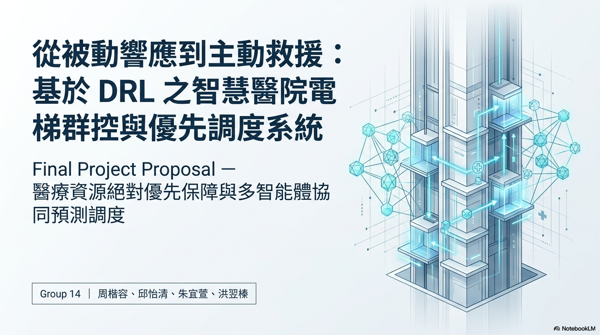

| 項目     | 內容                                         |
| -------- | -------------------------------------------- |
| 課程     | 深度強化學習 期末專題                          |
| 團隊     | Group 14 — 周楷容、邱怡清、朱宜萱、洪翌榛      |
| 版本     | v1.0                                        |
| 開發週期 | 約 8 週                                      |

---

## 📋 目錄

- [問題背景](#-問題背景)
- [解決方案](#-解決方案the-elegant-solution)
- [系統架構](#-系統架構)
- [MDP 建模](#-mdp-建模)
- [獎勵函數設計](#-獎勵函數設計)
- [演算法設計](#-演算法設計)
- [優先調度機制](#-優先調度機制)
- [模擬引擎與視覺化](#-模擬引擎與視覺化)
- [評估框架](#-評估框架)
- [風險分析](#-風險分析與緩解)
- [開發里程碑](#-開發里程碑)
- [專案結構](#-專案結構)
- [快速開始](#-快速開始)
- [技術棧](#-技術棧)
- [參考文獻](#-參考文獻)

---

## 🏥 問題背景

在大型醫院的垂直交通管理中，每一秒的延誤都可能影響醫療救護品質。傳統電梯系統採用固定規則調度（如最近者優先 Nearest Car），**無法區分「一般探病家屬」與「運送中的急診病床」**，導致高優先級醫療任務在尖峰時段被迫與一般乘客競爭電梯資源。

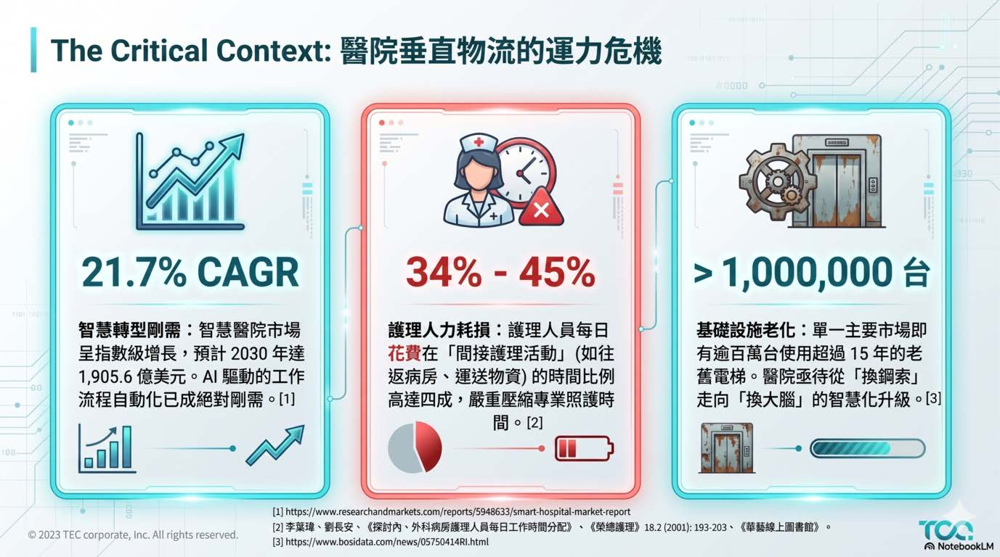

### 傳統演算法的「醫療語意缺失」

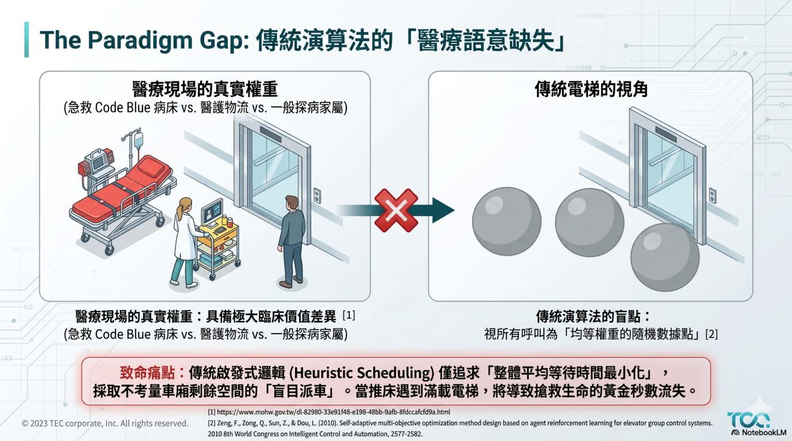

### 調度技術演進與缺口

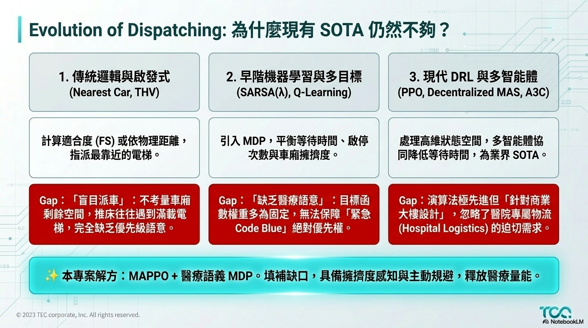

---

## 💡 解決方案：The Elegant Solution

本專案導入 **深度強化學習（DRL）** 作為電梯群控系統的「中央智慧大腦」，賦予系統以下能力：

- 🔮 **主動預測**：根據當前電梯狀態、乘客分佈與歷史交通流模式，預判最優派梯策略
- 🏷️ **優先權感知**：透過無感感測技術（NFC/BLE 模擬），自動識別急診病床、醫護人員、輪椅族群等特殊身份
- 🤝 **群控協作**：AI 監控整棟電梯的「負載平衡」，當緊急任務發生時能即時重新分配指派

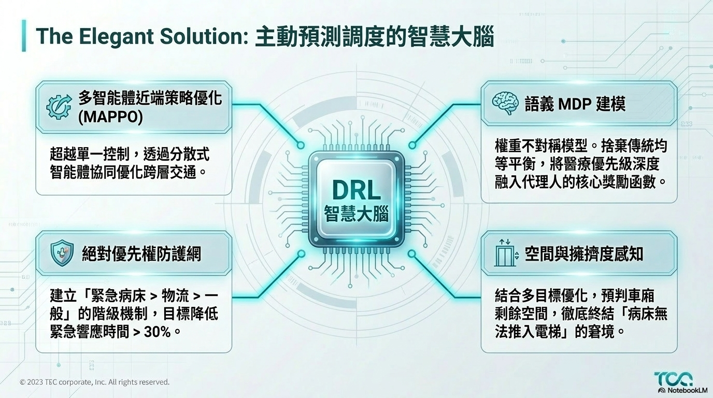

### 預期成果 KPI

| KPI                    | 目標                        |
| ---------------------- | --------------------------- |
| 急診任務平均等待時間   | 相較傳統規則降低 **≥ 30%** |
| 全體乘客平均等待時間   | 相較傳統規則降低 **≥ 15%** |
| 電梯空跑率（無效移動） | 降低 **≥ 20%**             |
| 訓練收斂               | ≤ 500K timesteps 內穩定    |

---

## 🏗️ 系統架構

採用**四層模組解耦架構**，各層職責分明：

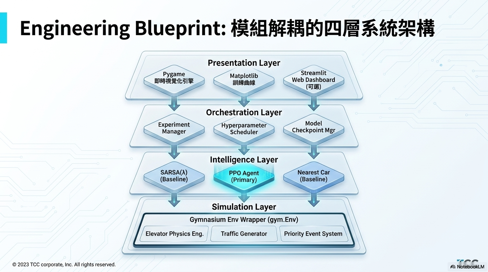

| 層級                  | 元件                                                       | 說明                     |
| --------------------- | ---------------------------------------------------------- | ------------------------ |
| **Presentation**      | Pygame 即時視覺化、Matplotlib 訓練曲線、Streamlit Dashboard | 展示與監控               |
| **Orchestration**     | Experiment Manager、Hyperparameter Scheduler、Checkpoint   | 實驗管理與模型管理       |
| **Intelligence**      | PPO Agent (主力)、SARSA(λ) Baseline、Nearest Car Baseline  | 決策智慧層               |
| **Simulation**        | Elevator Physics、Traffic Generator、Priority Event System | 環境模擬（Gymnasium）    |

---

## 🧠 MDP 建模

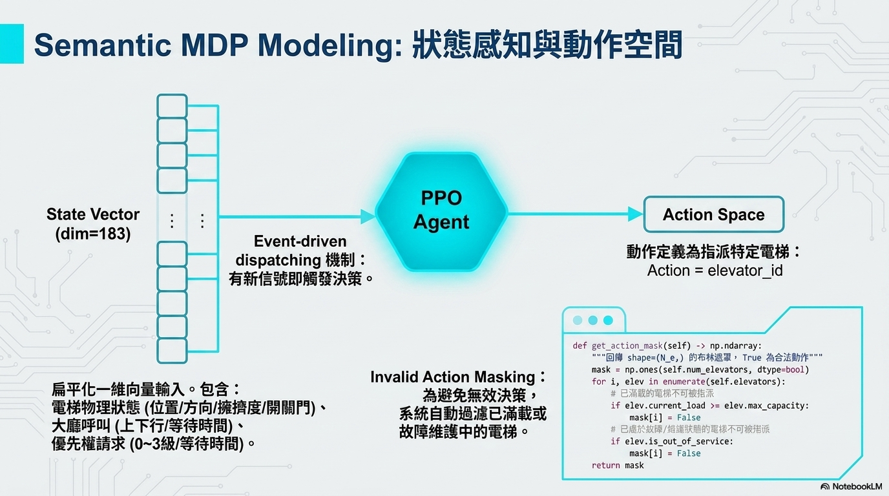

### State Space（狀態空間, dim=183）

以 $N_e=4$ 台電梯、$N_f=16$ 層樓為例，狀態向量包含：

| 子向量                 | 維度              | 說明                                     |
| ---------------------- | ----------------- | ---------------------------------------- |
| 電梯狀態 × 4           | $4 \times 21 = 84$ | 位置、方向、載客率、門態、內呼、閒置時間 |
| 大廳呼叫               | $4 \times 16 = 64$ | 上/下行呼叫 + 等待時間                    |
| 優先權資訊             | $2 \times 16 = 32$ | 優先請求等級 + 等待時間                    |
| 全域特徵               | 3                  | 時段、交通強度、急診事件數                 |

### Action Space（動作空間）

- **類型**: `Discrete(4)` — 指派電梯 ID
- **觸發**: Event-driven，新 Hall Call 或 Priority Event 產生時
- **Action Masking**: 自動過濾已滿載或故障電梯（使用 `MaskablePPO`）

---

## 🎯 獎勵函數設計

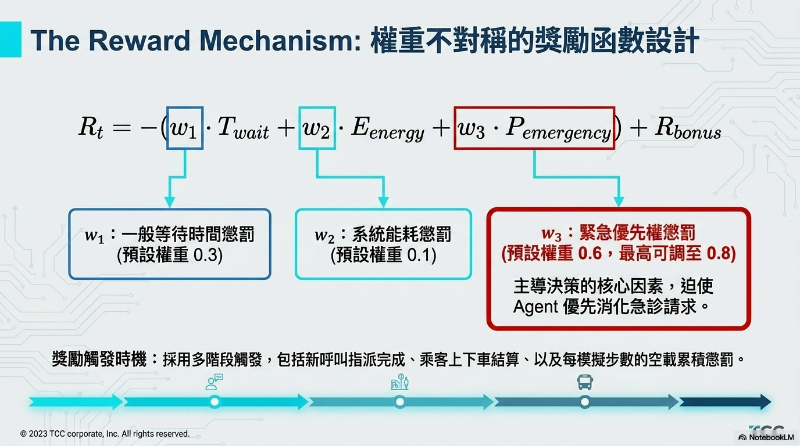

$$R_t = -\left( w_1 \cdot \hat{T}_{wait} + w_2 \cdot \hat{E}_{energy} + w_3 \cdot \hat{P}_{emergency} \right) + R_{bonus}$$

| 分量                     | 權重 (預設) | 說明                                     |
| ------------------------ | ---------- | ---------------------------------------- |
| $\hat{T}_{wait}$        | $w_1=0.3$  | 一般等待時間懲罰（正規化平均）             |
| $\hat{E}_{energy}$      | $w_2=0.1$  | 能耗懲罰（無效停靠 + 空載移動）           |
| $\hat{P}_{emergency}$   | $w_3=0.6$  | 緊急等待懲罰（**非線性平方遞增**，主導因素）|
| $R_{bonus}$              | —          | 優先任務閾值內完成 +2.0、負載均衡 +0.5    |

> 💡 $w_3$ 權重最高（0.6），迫使 Agent 學會優先消化急診請求。緊急懲罰以平方遞增，等待越久懲罰越重。

---

## ⚙️ 演算法設計

### 主力演算法：PPO (Proximal Policy Optimization)

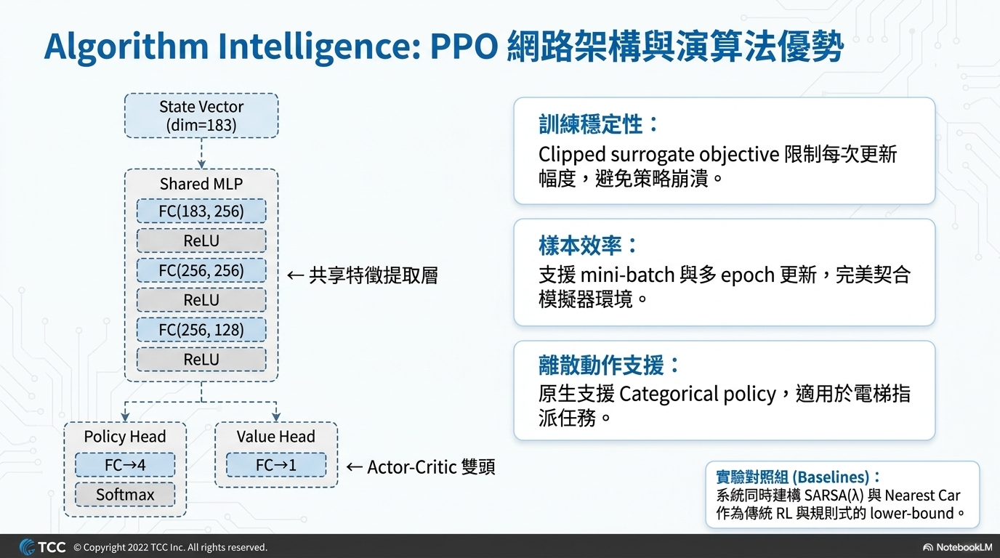

**網路架構**: Shared MLP (183→256→256→128) + Actor-Critic 雙頭

**核心超參數**:

| 參數             | 值      |
| ---------------- | ------- |
| Learning Rate    | 3e-4    |
| n_steps          | 2048    |
| Batch Size       | 64      |
| Gamma            | 0.99    |
| GAE Lambda       | 0.95    |
| Clip Range       | 0.2     |
| Entropy Coef     | 0.01    |
| Total Timesteps  | 1M      |

### Baseline 對照組

| 演算法          | 角色          | 說明                                    |
| --------------- | ------------- | --------------------------------------- |
| **SARSA(λ)**   | 傳統 RL 對照  | Tile Coding + ε-greedy，參考論文實作    |
| **Nearest Car** | 規則式下界    | 距離最近且方向相容的電梯，作為 lower-bound |

---

## 🚨 優先調度機制

### 三級優先權體系

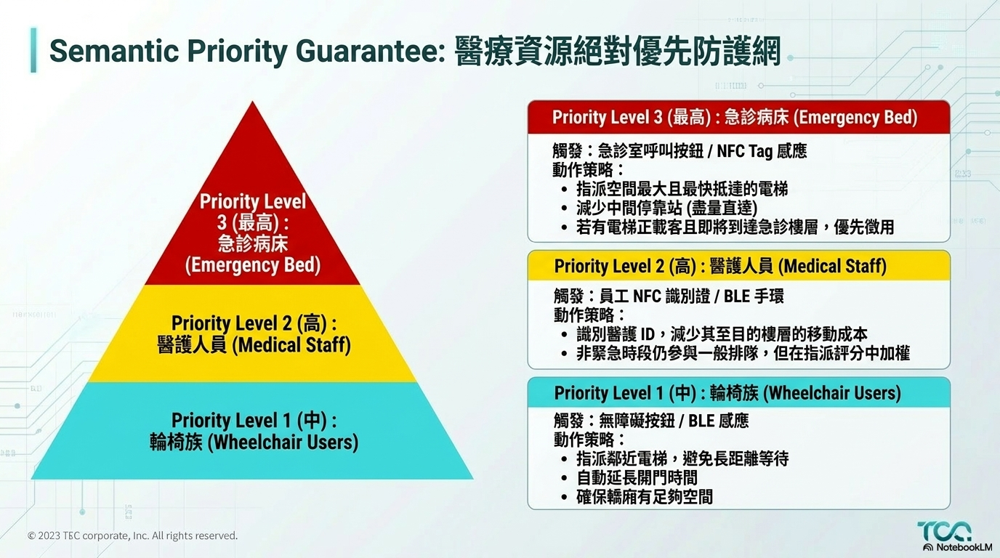

| Level | 身份             | 觸發方式             | 調度策略                       |
| ----- | ---------------- | -------------------- | ------------------------------ |
| 3 🔴  | 急診病床          | 急診室按鈕/NFC Tag   | 直達、減少停靠、可搶佔現有任務 |
| 2 🟡  | 醫護人員          | 員工 NFC/BLE 手環    | 指派評分加權，減少移動成本     |
| 1 🔵  | 輪椅族            | 無障礙按鈕/BLE       | 鄰近派梯、延長開門、確保空間   |

**設計哲學**：優先權不是硬編碼覆蓋，而是透過 **State Encoding + Reward Shaping + Action Masking** 三管齊下，讓 Agent 自主學會尊重優先權。搶佔機制僅作為 Level 3 的安全網 (fallback)。

---

## 🎮 模擬引擎與視覺化

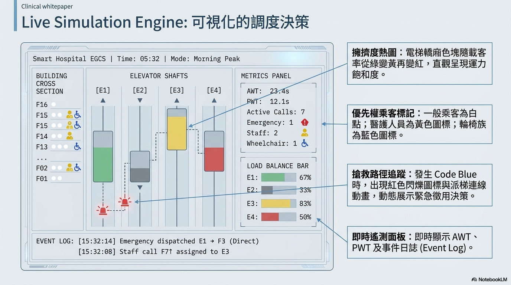

### 環境配置

- **建築**: 16 層、4 台電梯、額定容量 12 人
- **物理**: 額定速度 2.5 m/s、加速度 1.0 m/s²、開關門各 1.0s
- **Episode**: 600 模擬秒（≈10 分鐘交通流場景）
- **交通模式**: 上班尖峰 / 下班尖峰 / 混合交通（Poisson 到達）

### Pygame 即時渲染

- 電梯轎廂色塊隨載客率變化（🟢→🟡→🔴）
- 急診病床：紅色閃爍圖標 + 派梯連線動畫
- 即時面板：AWT、PWT、負載均衡條、事件日誌

---

## 📊 評估框架

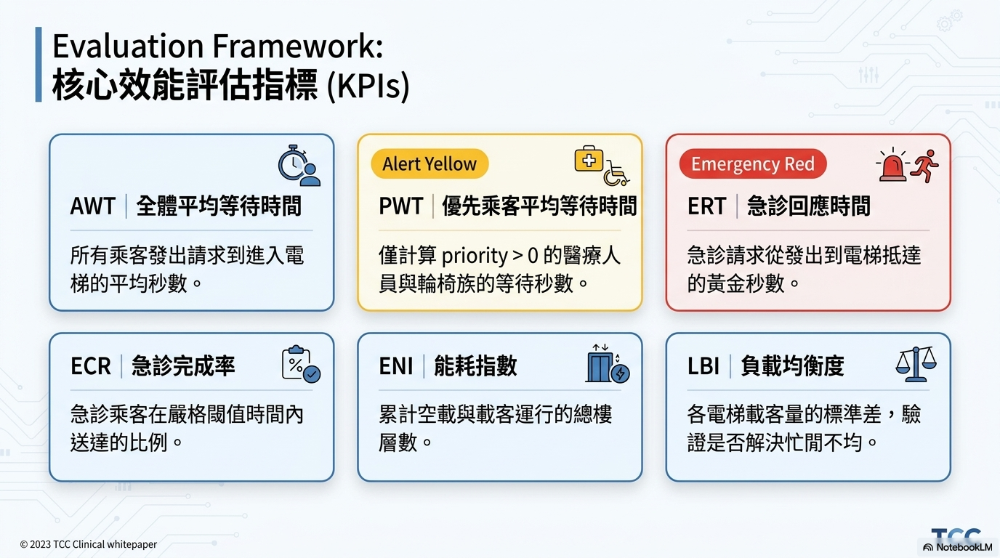

| KPI | 名稱               | 計算方式                               |
| --- | ------------------ | -------------------------------------- |
| AWT | 全體平均等待時間   | 所有乘客等待秒數的平均值               |
| PWT | 優先乘客等待時間   | 僅 priority > 0 的乘客                 |
| ERT | 急診回應時間       | 急診請求到電梯到達的平均秒數             |
| ECR | 急診完成率         | 閾值時間內送達的急診比例               |
| ENI | 能耗指數           | 空載 + 載客運行的累計樓層數             |
| LBI | 負載均衡度         | 各電梯載客量標準差                     |

**統計檢驗**: 獨立 t-test + 95% CI + Cohen's d，每場景 ≥ 100 episodes。

---

## ⚠️ 風險分析與緩解

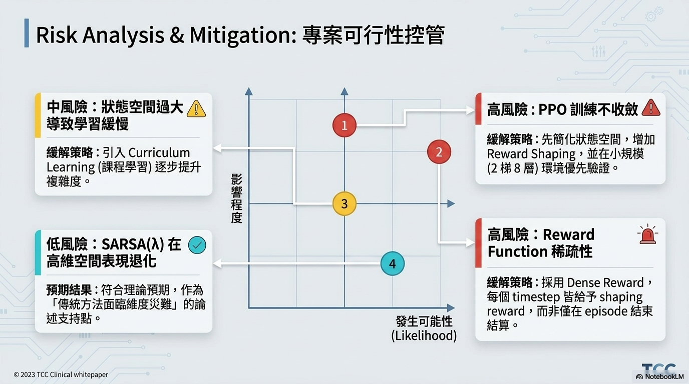

| 風險                       | 影響 | 緩解策略                                            |
| -------------------------- | ---- | --------------------------------------------------- |
| PPO 訓練不收斂              | 🔴   | 簡化狀態空間 → 增 Reward Shaping → 小規模先驗證    |
| Reward Function 稀疏性      | 🔴   | 每 timestep 皆給 shaping reward                     |
| 狀態空間過大致學習緩慢      | 🟡   | Curriculum Learning 逐步提升複雜度                   |
| SARSA(λ) 高維退化           | 🟢   | 預期結果，作為「傳統方法瓶頸」的論述支持             |

---

## 📅 開發里程碑

| Phase | 週次    | 重點任務                                   | 關鍵交付物                     |
| ----- | ------- | ------------------------------------------ | ------------------------------ |
| 1     | Week 1-2| 電梯物理模型、建築模型、乘客模型、交通流    | `elevator.py`, `building.py`   |
| 2     | Week 3-4| Gymnasium 封裝、優先權系統、Baseline、Pygame| `elevator_env.py`, renderer    |
| 3     | Week 5-6| PPO 訓練、Reward 調優、SARSA 實作、超參搜索| `train.py`, best model         |
| 4     | Week 7-8| 完整評估、圖表生成、Demo、報告撰寫         | 評估報告、展示簡報             |

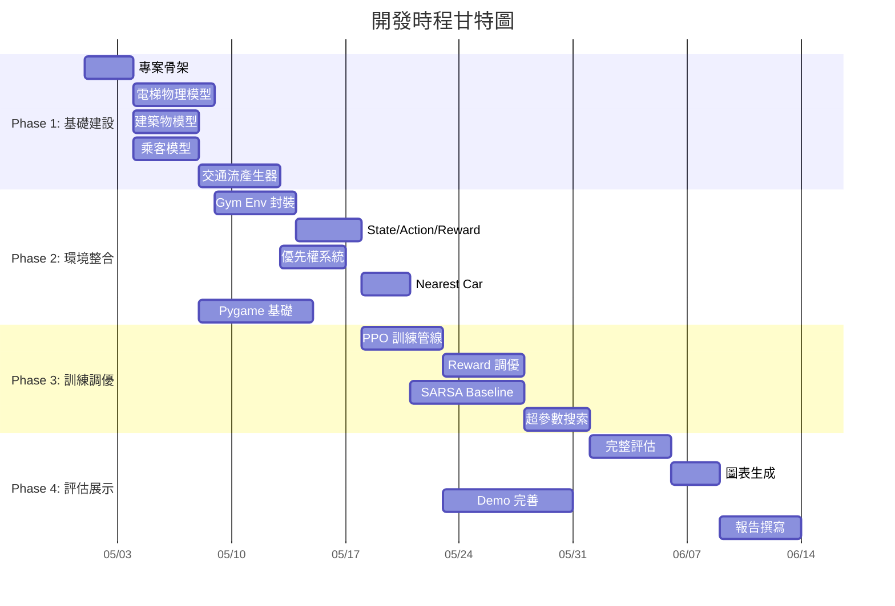

---

## 📁 專案結構

```
elevator-egcs/
├── configs/                    # 設定檔目錄
│   ├── env_default.yaml        # 環境預設參數
│   ├── train_ppo.yaml          # PPO 訓練超參數
│   └── scenarios/              # 交通流場景
│       ├── morning_peak.yaml
│       ├── evening_peak.yaml
│       └── mixed_traffic.yaml
├── src/
│   ├── envs/                   # Simulation Layer
│   │   ├── elevator_env.py     # Gymnasium 環境主類別
│   │   ├── building.py         # 建築物模型
│   │   ├── elevator.py         # 單台電梯物理模型
│   │   ├── passenger.py        # 乘客模型（含優先級）
│   │   ├── traffic_generator.py# 交通流產生器
│   │   └── priority_system.py  # 優先權事件系統
│   ├── agents/                 # Intelligence Layer
│   │   ├── ppo_agent.py        # PPO 代理人封裝
│   │   ├── sarsa_agent.py      # SARSA(λ) baseline
│   │   └── rule_based.py       # 規則式 baseline
│   ├── rewards/                # 獎勵函數模組
│   │   └── reward_functions.py
│   ├── utils/                  # 工具模組
│   │   ├── metrics.py          # KPI 計算
│   │   ├── logger.py           # 日誌工具
│   │   └── config_loader.py    # 設定檔載入
│   └── visualization/          # Presentation Layer
│       ├── pygame_renderer.py  # Pygame 即時渲染
│       ├── charts.py           # 靜態圖表生成
│       └── dashboard.py        # Web Dashboard (可選)
├── scripts/
│   ├── train.py                # 訓練入口
│   ├── evaluate.py             # 評估腳本
│   ├── demo.py                 # Demo 展示
│   └── compare_baselines.py    # Baseline 比較
├── tests/                      # 測試套件
├── notebooks/                  # Jupyter 分析
├── models/                     # 訓練模型存放
├── logs/                       # TensorBoard 日誌
├── docs/images/                # 文件圖片
├── requirements.txt
├── pyproject.toml
├── OpenSpec.md                 # 完整技術規格書
└── README.md                   # 本文件
```

---

## 🚀 快速開始

### 環境需求

- Python ≥ 3.10
- CUDA (建議，非必要)

### 安裝

```bash
# 克隆專案
git clone <repo-url>
cd elevator-egcs

# 建立虛擬環境
python -m venv venv
source venv/bin/activate  # Windows: venv\Scripts\activate

# 安裝依賴
pip install -r requirements.txt

# 開發模式安裝
pip install -e .
```

### 訓練

```bash
# PPO 訓練
python scripts/train.py --config configs/train_ppo.yaml

# 監控訓練
tensorboard --logdir logs/
```

### 評估與比較

```bash
# 評估訓練好的模型
python scripts/evaluate.py --model models/ppo/best_model.zip

# 三種演算法比較
python scripts/compare_baselines.py
```

### Demo 展示

```bash
# 啟動 Pygame 即時視覺化
python scripts/demo.py --render
```

---

## 🔧 技術棧

| 類別          | 技術                          | 版本     |
| ------------- | ----------------------------- | -------- |
| 語言          | Python                       | ≥ 3.10  |
| RL 環境       | Gymnasium                    | ≥ 0.29  |
| RL 框架       | Stable-Baselines3 (+ contrib)| ≥ 2.0   |
| 視覺化        | Pygame                       | ≥ 2.5   |
| 繪圖          | Matplotlib / Seaborn          | Latest   |
| 實驗追蹤      | TensorBoard / W&B            | Latest   |
| 數值計算      | NumPy                        | ≥ 1.24  |
| 測試          | pytest                       | ≥ 7.0   |

---

## 🌟 預期臨床影響

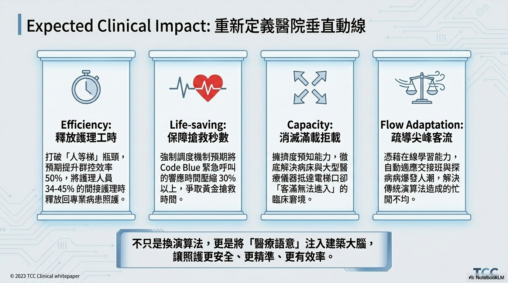

> 不只是換演算法，更是將「醫療語意」注入建築大腦，讓照護更安全、更精準、更有效率。

---

## 📚 參考文獻

1. **專案提案書**：〈基於 DRL 之智慧醫院電梯群控與優先調度系統〉
2. **曾凡琳, 宗群, 孫正雅, 竇立謙** (2009). *基于 Agent 的强化学习电梯群控自适应多目标优化方法设计*. IEEE CDC/CCC Joint Conference. pp. 2577-2582.
3. Crites, R., & Barto, A. (1998). *Elevator Group Control using Multiple Reinforcement Learning Agents*. Machine Learning, 32(2), 235-262.
4. Schulman, J. et al. (2017). *Proximal Policy Optimization Algorithms*. arXiv:1707.06347.
5. Raffin, A. et al. (2021). *Stable-Baselines3: Reliable Reinforcement Learning Implementations*. JMLR, 22(268), 1-8.

---

## 📄 授權

本專案為國立中興大學深度強化學習課程期末專題。

> 📖 完整技術規格請參閱 [OpenSpec.md](OpenSpec.md)
