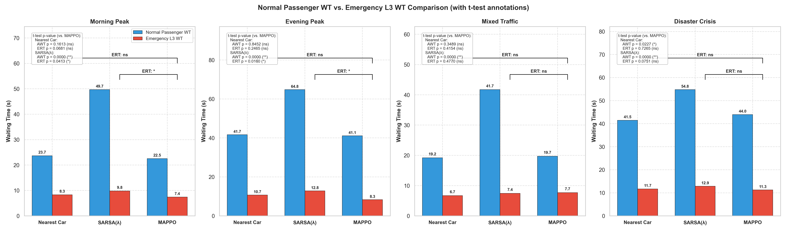
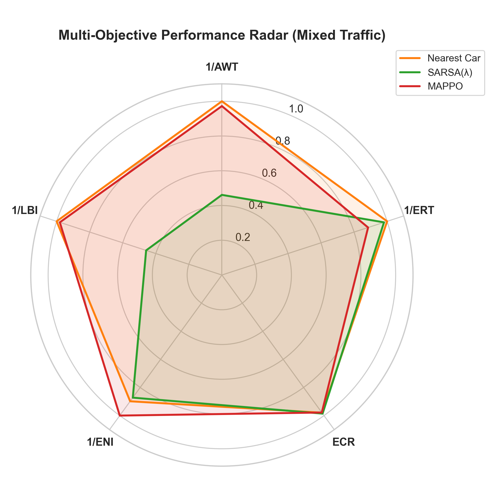
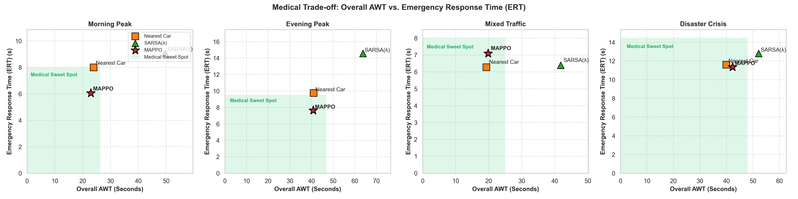
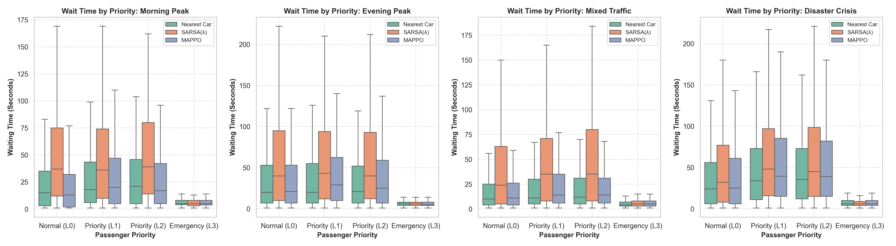
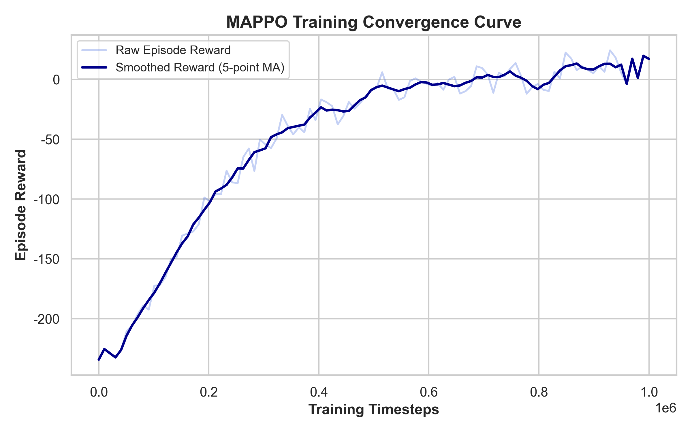

# Scientific Evaluation Report
*Generated on: 2026-06-01 22:02:24*

## Executive Summary
This report outlines the scientific evaluation and comparative benchmarking of the Multi-Agent PPO (MAPPO), SARSA(λ), and Nearest Car elevator control algorithms across multiple traffic distribution scenarios.

## Scenario Metrics Comparison
### Scenario: Morning Peak
| Metric | MAPPO | SARSA(λ) | Nearest Car |
| :--- | :---: | :---: | :---: |
| AWT (s) | 22.94 | 49.65 | 23.92 |
| ERT (s) | 6.05 | 9.04 | 7.99 |
| ECR (%) | 98.40 | 95.36 | 95.04 |
| NSS (times) | 179.30 | 146.85 | 173.43 |

### Scenario: Evening Peak
| Metric | MAPPO | SARSA(λ) | Nearest Car |
| :--- | :---: | :---: | :---: |
| AWT (s) | 40.76 | 63.76 | 40.97 |
| ERT (s) | 7.65 | 14.56 | 9.76 |
| ECR (%) | 96.51 | 93.36 | 95.22 |
| NSS (times) | 188.13 | 160.73 | 185.74 |

### Scenario: Mixed Traffic
| Metric | MAPPO | SARSA(λ) | Nearest Car |
| :--- | :---: | :---: | :---: |
| AWT (s) | 19.84 | 41.83 | 19.29 |
| ERT (s) | 7.09 | 6.39 | 6.27 |
| ECR (%) | 97.82 | 98.60 | 97.97 |
| NSS (times) | 168.04 | 133.54 | 164.67 |

### Scenario: Disaster Crisis
| Metric | MAPPO | SARSA(λ) | Nearest Car |
| :--- | :---: | :---: | :---: |
| AWT (s) | 42.30 | 52.14 | 39.93 |
| ERT (s) | 11.36 | 12.80 | 11.60 |
| ECR (%) | 93.18 | 91.73 | 92.67 |
| NSS (times) | 195.30 | 180.65 | 194.87 |

## Visualizations
### 1. Normal vs. Emergency Waiting Time

### 2. Multi-Objective Performance Radar

### 3. Medical AWT vs. ERT Trade-off

### 4. Waiting Time Distribution by Passenger Priority

### 5. MAPPO Training Convergence

