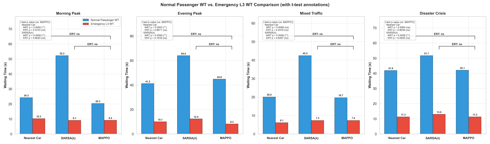
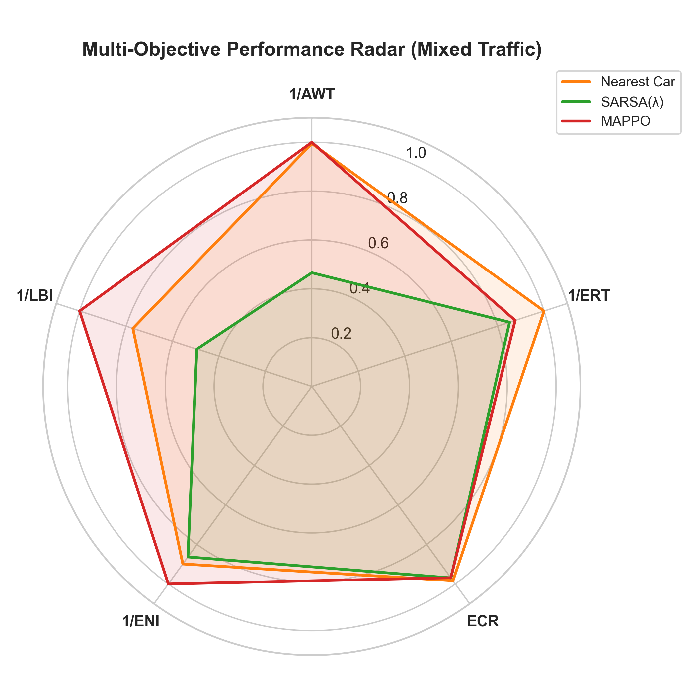
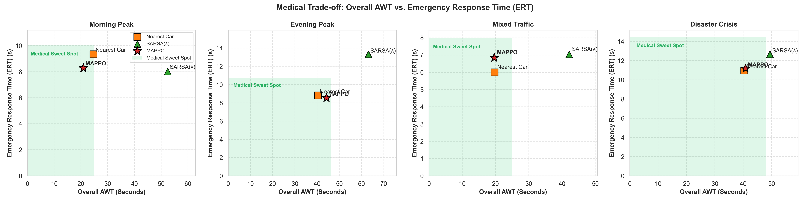
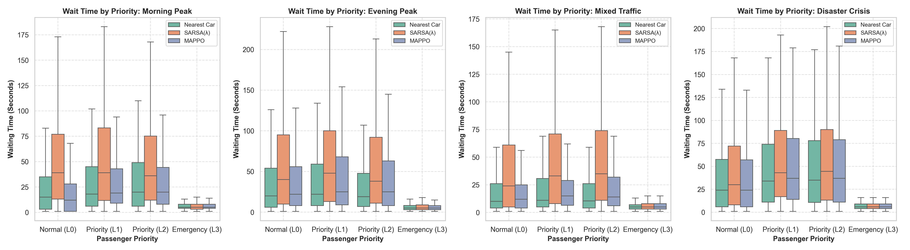
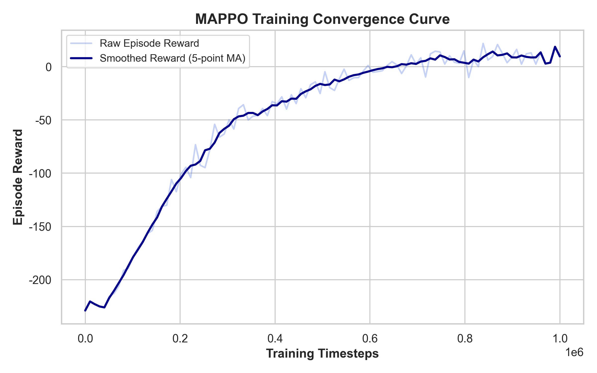

# Scientific Evaluation Report
*Generated on: 2026-06-01 20:47:54*

## Executive Summary
This report outlines the scientific evaluation and comparative benchmarking of the Multi-Agent PPO (MAPPO), SARSA(λ), and Nearest Car elevator control algorithms across multiple traffic distribution scenarios.

## Scenario Metrics Comparison
### Scenario: Morning Peak
| Metric | MAPPO | SARSA(λ) | Nearest Car |
| :--- | :---: | :---: | :---: |
| AWT (s) | 20.89 | 52.43 | 24.68 |
| ERT (s) | 8.29 | 8.03 | 9.34 |
| ECR (%) | 97.26 | 96.00 | 94.49 |
| NSS (times) | 180.01 | 146.87 | 172.10 |

### Scenario: Evening Peak
| Metric | MAPPO | SARSA(λ) | Nearest Car |
| :--- | :---: | :---: | :---: |
| AWT (s) | 44.21 | 63.08 | 40.36 |
| ERT (s) | 8.55 | 13.31 | 8.82 |
| ECR (%) | 95.69 | 94.57 | 95.34 |
| NSS (times) | 189.06 | 160.98 | 185.59 |

### Scenario: Mixed Traffic
| Metric | MAPPO | SARSA(λ) | Nearest Car |
| :--- | :---: | :---: | :---: |
| AWT (s) | 19.64 | 42.15 | 19.74 |
| ERT (s) | 6.85 | 7.04 | 6.00 |
| ECR (%) | 96.83 | 96.93 | 98.35 |
| NSS (times) | 167.99 | 134.75 | 163.11 |

### Scenario: Disaster Crisis
| Metric | MAPPO | SARSA(λ) | Nearest Car |
| :--- | :---: | :---: | :---: |
| AWT (s) | 40.80 | 49.40 | 40.36 |
| ERT (s) | 11.18 | 12.65 | 10.98 |
| ECR (%) | 93.87 | 92.25 | 93.45 |
| NSS (times) | 199.04 | 183.44 | 195.52 |

## Visualizations
### 1. Normal vs. Emergency Waiting Time

### 2. Multi-Objective Performance Radar

### 3. Medical AWT vs. ERT Trade-off

### 4. Waiting Time Distribution by Passenger Priority

### 5. MAPPO Training Convergence

