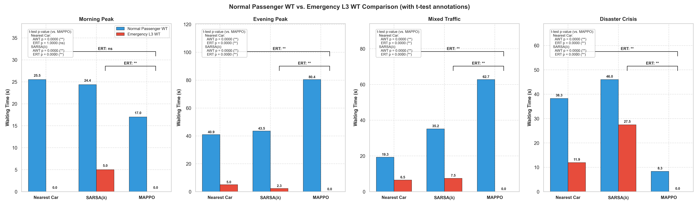
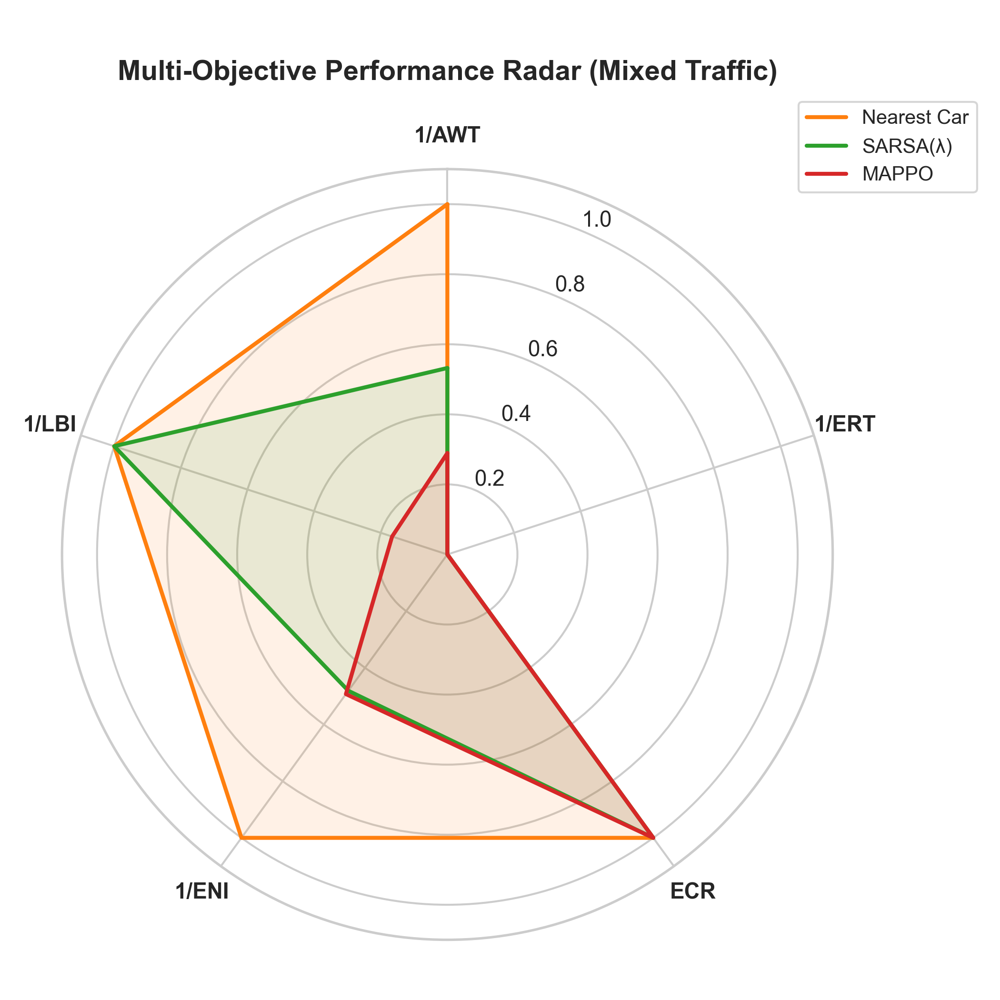
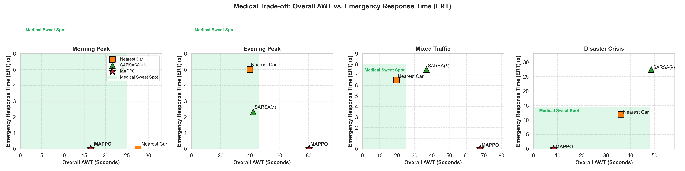
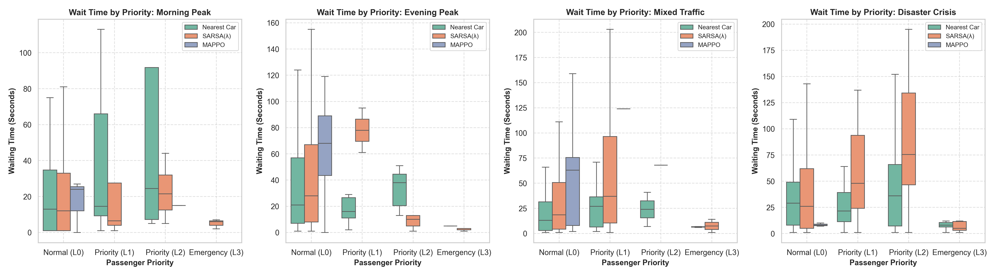
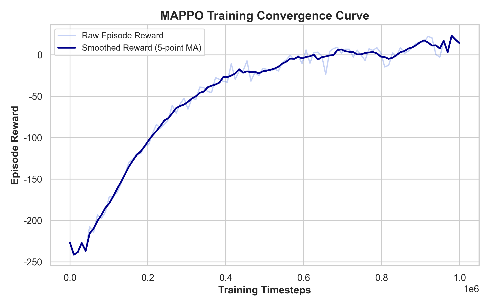

# Scientific Evaluation Report
*Generated on: 2026-06-01 14:29:29*

## Executive Summary
This report outlines the scientific evaluation and comparative benchmarking of the Multi-Agent PPO (MAPPO), SARSA(λ), and Nearest Car elevator control algorithms across multiple traffic distribution scenarios.

## Scenario Metrics Comparison
### Scenario: Morning Peak
| Metric | MAPPO | SARSA(λ) | Nearest Car |
| :--- | :---: | :---: | :---: |
| AWT (s) | 16.50 | 23.98 | 27.64 |
| ERT (s) | 0.00 | 5.00 | 0.00 |
| ECR (%) | 100.00 | 100.00 | 100.00 |
| NSS (times) | 501.00 | 46.00 | 39.00 |

### Scenario: Evening Peak
| Metric | MAPPO | SARSA(λ) | Nearest Car |
| :--- | :---: | :---: | :---: |
| AWT (s) | 80.39 | 42.27 | 39.88 |
| ERT (s) | 0.00 | 2.33 | 5.00 |
| ECR (%) | 100.00 | 100.00 | 100.00 |
| NSS (times) | 456.00 | 85.00 | 98.00 |

### Scenario: Mixed Traffic
| Metric | MAPPO | SARSA(λ) | Nearest Car |
| :--- | :---: | :---: | :---: |
| AWT (s) | 67.83 | 36.88 | 19.63 |
| ERT (s) | 0.00 | 7.50 | 6.50 |
| ECR (%) | 100.00 | 100.00 | 100.00 |
| NSS (times) | 684.00 | 57.00 | 48.00 |

### Scenario: Disaster Crisis
| Metric | MAPPO | SARSA(λ) | Nearest Car |
| :--- | :---: | :---: | :---: |
| AWT (s) | 8.33 | 48.63 | 36.26 |
| ERT (s) | 0.00 | 27.47 | 11.94 |
| ECR (%) | 100.00 | 80.00 | 87.50 |
| NSS (times) | 294.00 | 69.00 | 78.00 |

## Visualizations
### 1. Normal vs. Emergency Waiting Time

### 2. Multi-Objective Performance Radar

### 3. Medical AWT vs. ERT Trade-off

### 4. Waiting Time Distribution by Passenger Priority

### 5. MAPPO Training Convergence

