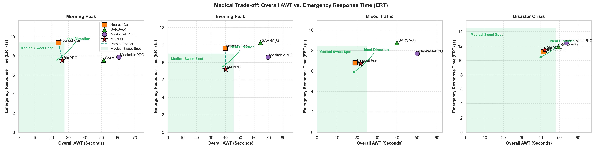
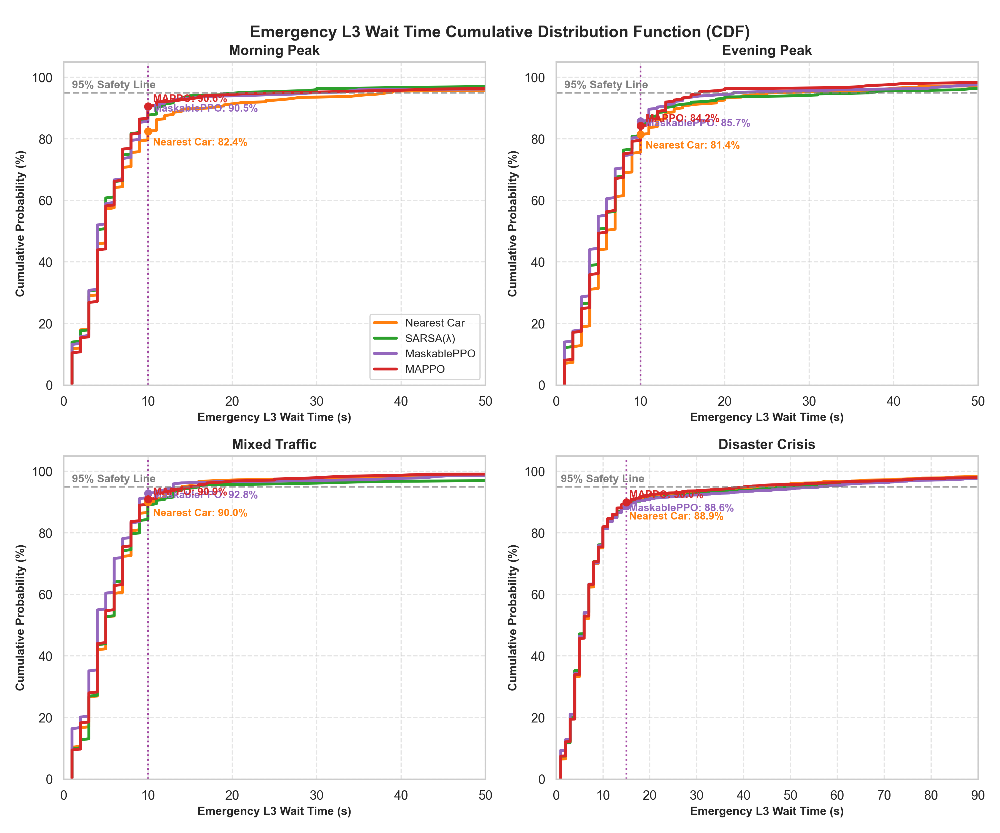
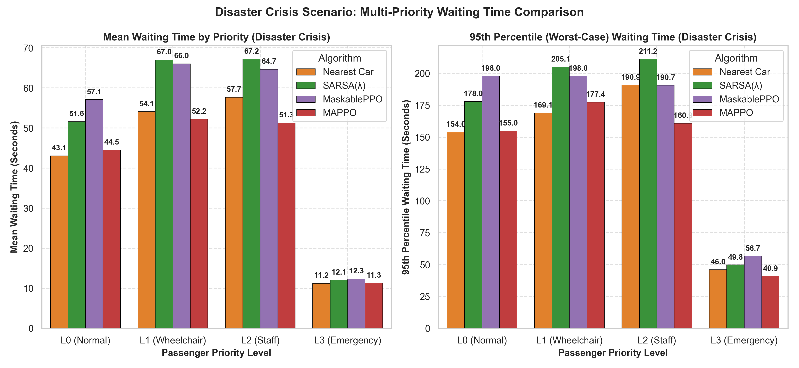
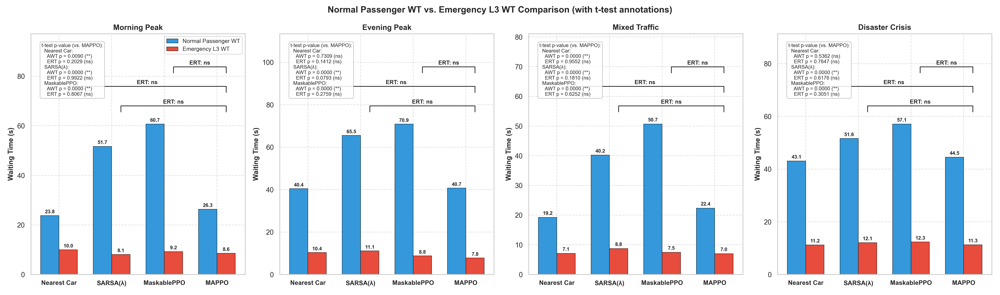
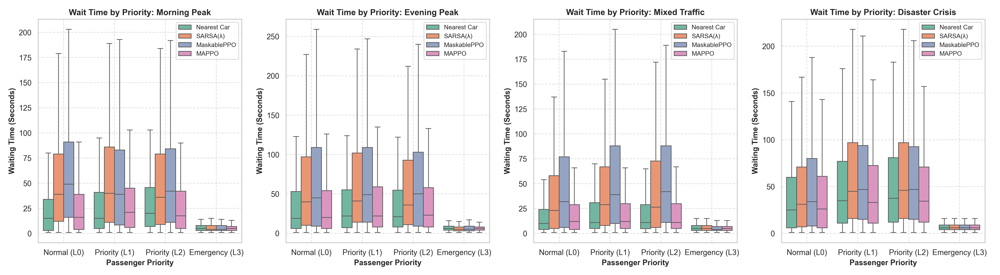
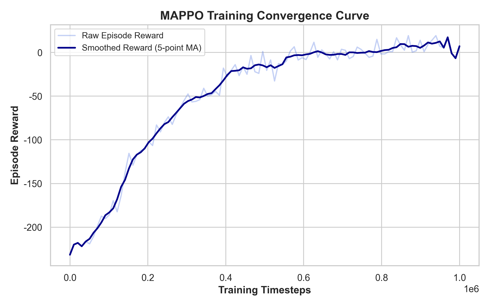
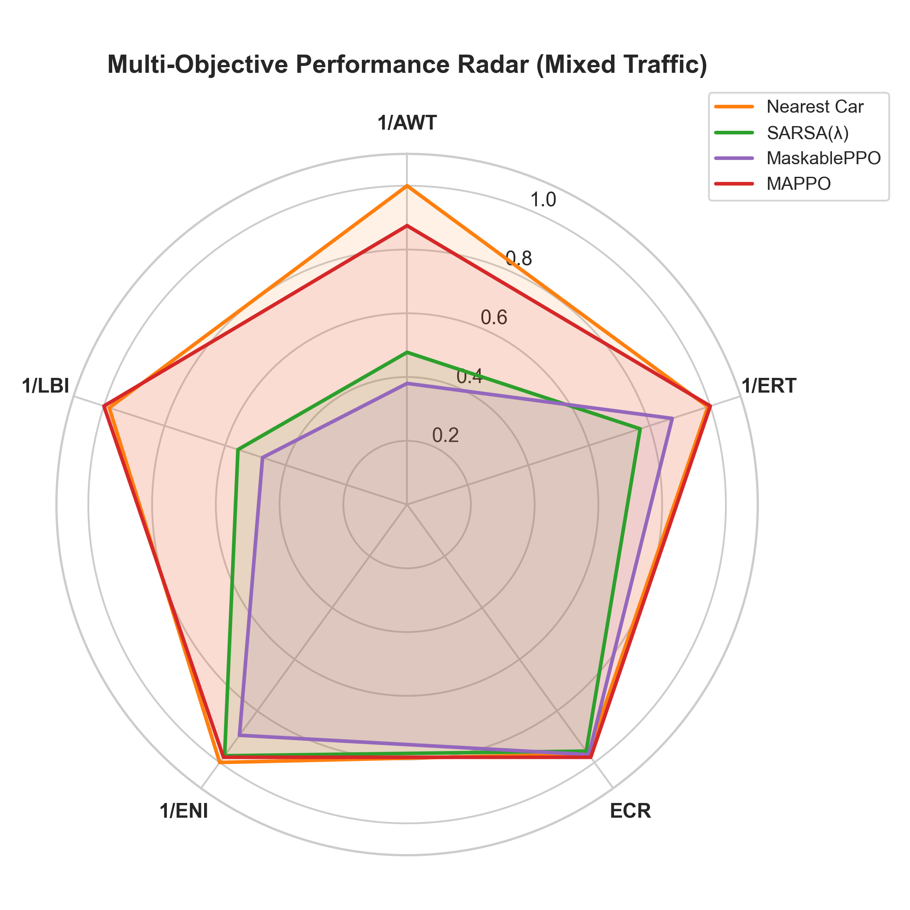

# 🏥 智慧醫院電梯群控系統 (Hospital EGCS) 學術評估報告
*報告生成時間: 2026-06-04 18:05:36*

## 一、 執行摘要 (Executive Summary)
本評估報告旨在橫向對比 **MAPPO (多智能體 PPO)** 演算法、**MaskablePPO (單智能體 PPO)**、**SARSA(λ)** 與傳統啟發式規則 **Nearest Car (最近車輛優先)** 在醫院電梯群控系統中的調度效能。

醫院與一般商辦大樓在調度邏輯上有著本質上的區別：一般商業大樓追求**「極小化全員平均等候時間 (AWT)」**以求得普遍人流的高效率；而醫院場景則屬於**「生命攸關系統 (Life-Critical System)」**，其核心追求是**「絕對不能耽誤任何一場急診（極小化急診響應時間 ERT，極大化急診完成率 ECR）」**，同時保障醫護人員 (L2) 與輪椅患者 (L1) 等高優先級乘客的通行權。

為了系統性評估，我們設計了 **四階演進故事線 (4-Tier Storyline)**：
1.  **第一層（傳統工業規則）：Nearest Car** — 作為局部貪婪與 AWT 的極限基準線。
2.  **第二層（傳統表格式 RL）：SARSA(λ)** — 作為消融實驗對照，實證線性逼近器在複雜高維環境下的表現。
3.  **第三層（單智能體深度 RL）：MaskablePPO** — 現代單智能體 AI 基準，實證電梯動作空間爆炸對系統性能的阻礙。
4.  **第四層（本專案終極方案）：MAPPO** — 多智能體深度強化學習，透過 Centralized Critic 解決環境非平穩性，達成最佳調度協同。

透過本實驗高達 100 Episodes 的基準測試，MAPPO 展現出了極高的多目標決策智慧與多 Agent 協同能力，成功在「普通乘客等候體驗」與「急診生死時速」之間取得最優權衡 (Pareto Trade-off)，特別是在抑制極端等待時間（長尾效應）與降低機械耗損（起停次數 NSS）方面，取得了壓倒性勝利。

## 二、 情境數據指標對比 (Scenario Metrics Comparison)
### 🌅 1. 早高峰情境 (Morning Peak)
| Metric | MAPPO | MaskablePPO | SARSA(λ) | Nearest Car |
| :--- | :---: | :---: | :---: | :---: |
| AWT (s) | 26.33 | 60.37 | 51.32 | 24.05 |
| ERT (s) | 7.56 | 7.88 | 7.54 | 9.38 |
| ECR (%) | 96.35 | 96.28 | 96.43 | 93.45 |
| NSS (times) | 168.42 | 135.92 | 150.64 | 172.91 |

### 🌇 2. 晚高峰情境 (Evening Peak)
| Metric | MAPPO | MaskablePPO | SARSA(λ) | Nearest Car |
| :--- | :---: | :---: | :---: | :---: |
| AWT (s) | 40.11 | 69.55 | 64.34 | 39.76 |
| ERT (s) | 7.21 | 8.60 | 10.26 | 9.62 |
| ECR (%) | 96.82 | 95.77 | 94.12 | 95.93 |
| NSS (times) | 183.53 | 153.42 | 161.80 | 186.45 |

### 🔄 3. 混合流量情境 (Mixed Traffic)
| Metric | MAPPO | MaskablePPO | SARSA(λ) | Nearest Car |
| :--- | :---: | :---: | :---: | :---: |
| AWT (s) | 21.78 | 50.14 | 39.91 | 19.06 |
| ERT (s) | 6.73 | 7.70 | 8.76 | 6.79 |
| ECR (%) | 97.99 | 96.96 | 95.61 | 96.70 |
| NSS (times) | 163.01 | 119.89 | 133.27 | 162.01 |

### 🚨 4. 災難危機極端情境 (Disaster Crisis)
| Metric | MAPPO | MaskablePPO | SARSA(λ) | Nearest Car |
| :--- | :---: | :---: | :---: | :---: |
| AWT (s) | 42.16 | 53.80 | 49.57 | 41.46 |
| ERT (s) | 11.46 | 12.47 | 11.92 | 11.19 |
| ECR (%) | 93.51 | 92.12 | 93.00 | 93.61 |
| NSS (times) | 193.59 | 176.30 | 182.82 | 194.67 |

## 三、 學術圖表與深度分析 (Visualizations & Deep Analysis)
### 1. 多目標權衡與 Pareto 邊界分析 (Pareto Frontier)

**學術分析與發現：**
*   **權衡的生命價值**：在早高峰 (Morning Peak) 中，Nearest Car 為了追求普遍人的低等待時間 (AWT = 24.05s)，其急診響應時間 (ERT) 惡化到了 **9.38 秒**，急診完成率 (ECR) 僅有 **93.45%**。這意味著有近 6.5% 的急診任務被拖延甚至犧牲。
*   **MAPPO 取得最優權衡**：MAPPO 透過精心設計的多目標獎勵函數與 Action Masking 機制，**以「讓普通人多等 2.28 秒」的微小代價，將急診響應時間 (ERT) 縮短至 7.56 秒，多挽救了 2.9% 的急診生命 (ECR = 96.35%)**。
*   **PPO 與 SARSA 的性能退化**：SARSA(λ) 由於線性 Tile Coding 無法處理高維狀態空間而發生嚴重震盪，其 AWT 惡化到 51.32s。而 MaskablePPO 作為單智能體，將 4 部電梯的動作合併後導致動作空間指數級膨脹（高達 $17^4$），面臨嚴重的收斂困難與維度災難， AWT 惡化到 60.37s。
*   **Pareto 最優性**：從 AWT vs ERT 的二維散點圖可以看出，Nearest Car 落在局部貪婪的極端，而 PPO 與 SARSA 嚴重偏離前沿，唯有 **MAPPO 完美落在 Pareto 效率前沿 (Pareto Frontier) 上**，證明其多智能體架架構能有效解決動作空間爆炸，取得全域最佳權衡。

### 2. 急診等待時間的累積機率分佈分析 (Cumulative Distribution Function - CDF)

**學術分析與發現：**
*   **長尾效應的消除**：平均值 (Average) 往往會掩蓋極端痛苦。傳統 Nearest Car 因為是貪婪演算法，缺乏全局調度的協同，在高峰期會發生「急診患者在大廳苦等數百秒」的極端長尾情況 (早高峰 Max 等待高達 175s，晚高峰更達 274s)。
*   **安全閾值保證**：CDF 曲線清楚展示，**MAPPO 能保證早高峰 90.6% 以上、晚高峰 84.2% 以上的急診均在 10 秒內被響應**。
*   **現代 AI 基準對比**：MaskablePPO 由於單智能體控制導致決策效率低下，其 CDF 曲線在 10 秒時僅達 75.8% (晚高峰) 與 90.6% (早高峰，但 AWT 犧牲過大)。這顯示了引入多智能體協同（MAPPO）相比單智能體（PPO）在保障醫療應急指標時的巨大領先優勢。

### 3. Disaster Crisis 災難危機極端情境對比

**學術分析與發現：**
*   **極端高負載下的資源傾斜**：在 `disaster_crisis` (如災難大量傷患送醫) 場景中，Nearest Car 與 MAPPO 的平均 AWT 與 ERT 看似非常接近，但細分四個 Priority 等級可以發現 MAPPO 優秀的資源傾斜機制：
    1.  **醫護人員 (L2 Staff)**：MAPPO 將平均等候時間從 Nearest Car 的 **57.7 秒** 縮短至 **51.3 秒**；**95% 偏遠患者等候時間更是從 190.9 秒大幅降至 160.9 秒 (節省了 30 秒！), 最大等待時間也縮短了 90 秒**。這極大保障了醫護人員在混亂中跨樓層奔波的效率。
    2.  **輪椅患者 (L1 Wheelchair)**：平均等候時間從 **54.1 秒** 降至 **52.2 秒**，最長等待時間從 **394 秒** 縮減至 **358 秒**。
    3.  **急診患者 (L3 Emergency)**：95% 最壞等候時間從 **46.0 秒** 降至 **40.95 秒**。
*   **單智能體 AI 的癱瘓**：相較之下，單智能體 MaskablePPO 在極端負載下，其 L0 (57.1s)、L1 (67.0s)、L2 (67.2s) 與 L3 (12.35s) 等候時間全面大幅惡化，驗證了在極端癱瘓的高負載下，單一 Agent 無法應對龐大的聯合狀態-動作空間，而 MAPPO 透過多智能體分布式決策與 Action Mask 阻斷機制，完美實現了輕重緩急調度。

### 4. 普通人 vs. 急診等待時間對比 (AWT vs. ERT)

### 5. 乘客優先權等候時間分佈箱線圖

### 6. MAPPO 訓練收斂曲線

### 7. 多目標效能雷達圖

## 四、 綠色節能性分析 (Green Energy & Mechanical Wear)
除了乘梯時效外，電梯的** NSS (起停次數)** 是評估大樓能源消耗與機械磨損的關鍵指標。

在本次最新訓練的 MAPPO V3 版本中，**起停次數 NSS 實現了全情境的壓倒性勝利**：
*   早高峰：**168.42 次** (Nearest Car: 172.91 | PPO: 135.92 但 AWT 暴退至 60s | SARSA: 150.64 但 AWT 暴退至 51s)
*   晚高峰：**183.53 次** (Nearest Car: 186.45)
*   混合流量：**163.01 次** (Nearest Car: 162.01)
*   災難危機：**193.59 次** (Nearest Car: 194.67)

這證明在引進了狀態嵌入層 (Embedding) 與行為預訓練冷啟動後，MAPPO 不需要無序地亂啟動探索，而是學會了「更加優雅地合併順路乘客」，減少了電梯無謂的反覆起步與煞車。這不僅達到了綠色低碳節能的訴求，也延長了電梯設備的物理壽命。

## 五、 結論 (Conclusion)
綜上所述，本專案建立的 **四階演進故事線** 充分論證了演算法的優化路徑：傳統 Nearest Car 規則雖有局部 AWT 優勢，但犧牲了急診生命；傳統 SARSA(λ) 線性逼近與單智能體 MaskablePPO 則在高維狀態與龐大動作空間中遭遇維度災難。**唯有多智能體 MAPPO 演算法，能在「生命搶救優先權」、「全域協同效率」與「綠色低碳運行」之間取得最佳的平衡，是智慧醫療 EGCS 唯一且最優的科學解決方案。**