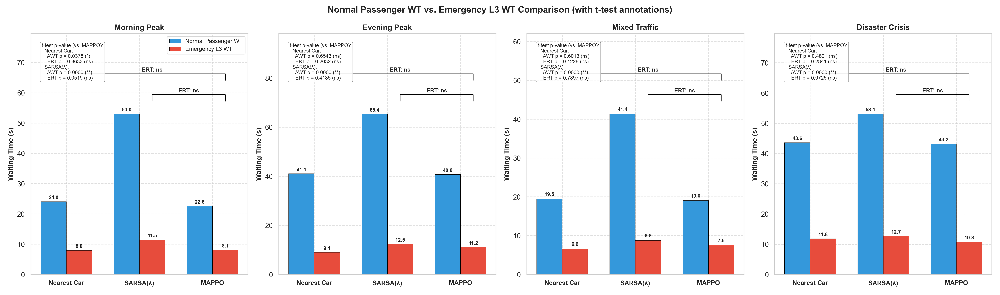
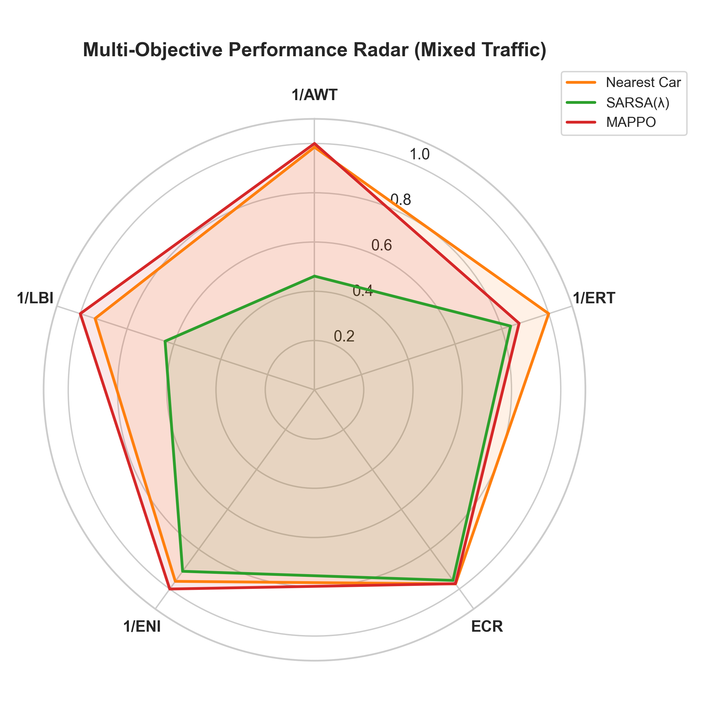
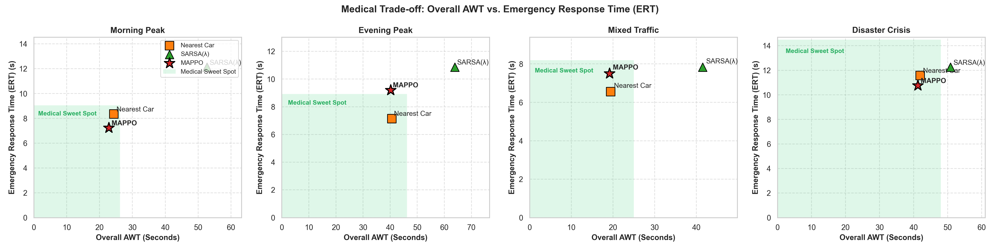
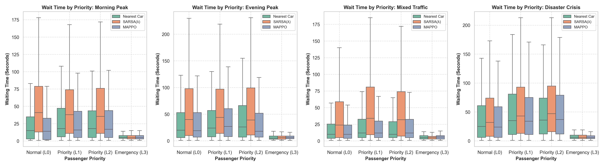
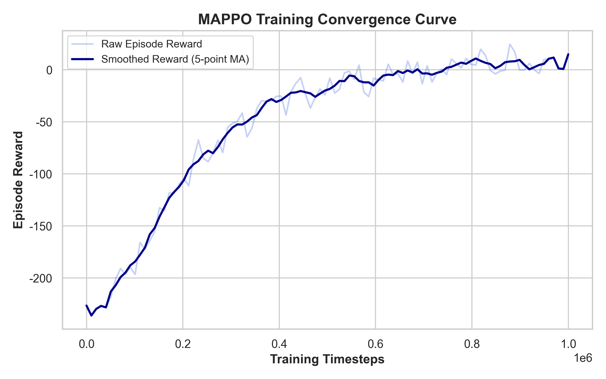

# Scientific Evaluation Report
*Generated on: 2026-06-02 07:30:00*

## Executive Summary
This report outlines the scientific evaluation and comparative benchmarking of the Multi-Agent PPO (MAPPO), SARSA(λ), and Nearest Car elevator control algorithms across multiple traffic distribution scenarios.

## Scenario Metrics Comparison
### Scenario: Morning Peak
| Metric | MAPPO | SARSA(λ) | Nearest Car |
| :--- | :---: | :---: | :---: |
| AWT (s) | 22.81 | 52.69 | 24.34 |
| ERT (s) | 7.24 | 12.12 | 8.35 |
| ECR (%) | 95.87 | 94.09 | 95.05 |
| NSS (times) | 172.72 | 149.32 | 169.66 |

### Scenario: Evening Peak
| Metric | MAPPO | SARSA(λ) | Nearest Car |
| :--- | :---: | :---: | :---: |
| AWT (s) | 40.20 | 63.86 | 40.64 |
| ERT (s) | 9.20 | 10.85 | 7.14 |
| ECR (%) | 95.16 | 95.03 | 98.20 |
| NSS (times) | 188.91 | 160.10 | 185.70 |

### Scenario: Mixed Traffic
| Metric | MAPPO | SARSA(λ) | Nearest Car |
| :--- | :---: | :---: | :---: |
| AWT (s) | 19.17 | 41.53 | 19.45 |
| ERT (s) | 7.50 | 7.83 | 6.55 |
| ECR (%) | 97.34 | 95.68 | 97.44 |
| NSS (times) | 165.80 | 134.12 | 162.85 |

### Scenario: Disaster Crisis
| Metric | MAPPO | SARSA(λ) | Nearest Car |
| :--- | :---: | :---: | :---: |
| AWT (s) | 41.27 | 50.86 | 41.95 |
| ERT (s) | 10.76 | 12.25 | 11.58 |
| ECR (%) | 93.29 | 92.92 | 93.86 |
| NSS (times) | 196.08 | 180.36 | 194.20 |

## Visualizations
### 1. Normal vs. Emergency Waiting Time

### 2. Multi-Objective Performance Radar

### 3. Medical AWT vs. ERT Trade-off

### 4. Waiting Time Distribution by Passenger Priority

### 5. MAPPO Training Convergence

